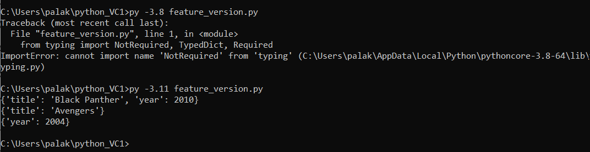

# Assignment 0
# Problem Statement
Setup 2 python versions (eg 3.8 and 3.11). Run a program that has latest python feature that works in 3.11+ but does not work in lower versions. Demonstrate how to install 2 versions of python and be able to switch seamlessly.

## Overview
This project demonstrates how to use **pyenv** to install and manage multiple Python versions on Windows. It also shows a Python 3.11 feature (`Required` and `NotRequired` from the `typing` module) that is not supported in Python 3.8.
## Setup

### 1. Install pyenv

Install **pyenv** to manage multiple Python versions.
### 2. Configure Environment Variables

Add the following directories to your system **PATH**:

- `C:\Users\<username>\.pyenv\pyenv-win\bin`
- `C:\Users\<username>\.pyenv\pyenv-win\shims`
### 3. Install Python Versions

Using pyenv, install multiple Python versions:

```bash
pyenv install 3.8.10
pyenv install 3.11.9
```
## Demonstration

The following program uses the `Required` and `NotRequired` features from the `typing` module.

```python
from typing import TypedDict, Required, NotRequired

class Movie(TypedDict):
    title: Required[str]
    year: int

m1: Movie = {"title": "Black Panther", "year": 2010}
m2: Movie = {"title": "Avengers"}
m3: Movie = {"year": 2004}
```
## Results

- **Python 3.11**
  - The program runs successfully because `Required` and `NotRequired` are supported in the standard `typing` module.

- **Python 3.8**
  - The program does not run because `Required` and `NotRequired` are not available in the standard `typing` module.
  

## Conclusion

This project demonstrates how **pyenv-win** makes it easy to install, manage, and switch between multiple Python versions. It also highlights the compatibility differences between Python 3.8 and Python 3.11 by using a feature introduced in newer Python versions.
