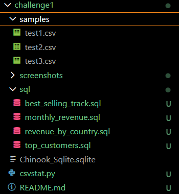
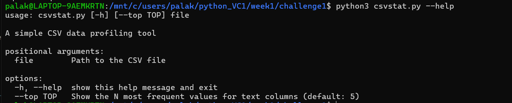
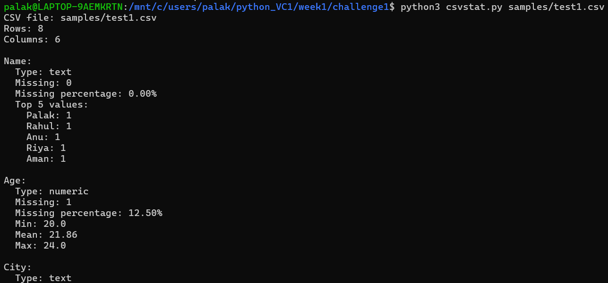
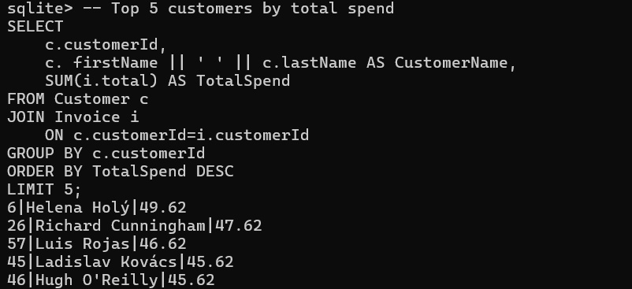
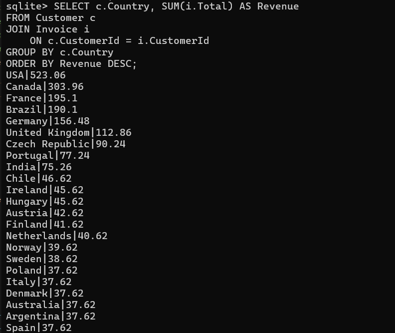
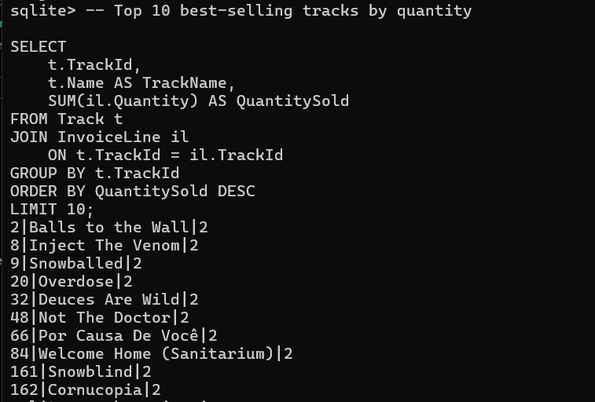
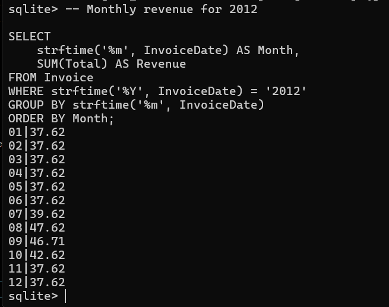

# csvstat: CSV Data Profiling + Chinook Sales Analysis

## Overview

This project contains two parts:

1. **Part A:** Build `csvstat`, a command-line CSV data profiling tool.
2. **Part B:** Perform SQL analysis using the Chinook sample sales database.

---

# Part A – CSVStat

## Objective

`csvstat` is a command-line tool that accepts a CSV file path and provides basic data profiling information.

## Features

- Accepts a CSV file path using `argparse`
- Prints the number of rows and columns
- Infers column types:
  - Numeric
  - Text
  - Date
- Calculates missing-value count and percentage
- Calculates minimum, mean, and maximum for numeric columns
- Supports `--top N` for the most frequent values of text columns
- Uses `5` as the default value for `N`
- Provides friendly error messages for missing or invalid CSV files

---

## Technologies Used

- Python 3
- `argparse`
- `csv`
- `datetime`
- `collections.Counter`
- SQLite

The project uses only the Python standard library. No external Python packages are required.

---

## How to Run

### Basic usage

```bash
python3 csvstat.py samples/test1.csv
Using --top
python3 csvstat.py samples/test1.csv --top 3
Help
python3 csvstat.py --help
Example Output
CSV file: samples/test1.csv
Rows: 8
Columns: 6

Name:
  Type: text
  Missing: 0
  Missing percentage: 0.00%
  Top 5 values:
    Palak: 1
    Rahul: 1

Age:
  Type: numeric
  Missing: 1
  Missing percentage: 12.50%
  Min: 20.0
  Mean: 21.86
  Max: 24.0
Error Handling

If the file does not exist:

python3 csvstat.py samples/missing.csv

The program displays a friendly error message instead of a Python traceback:

Error: File 'samples/missing.csv' was not found.

Project Structure


csvstat Help

### Run:

python3 csvstat.py --help



csvstat with --top

### Run:

python3 csvstat.py samples/test1.csv --top 3



Error Handling

### Run:

python3 csvstat.py samples/missing.csv


# Part B – SQL Analysis

The SQL analysis uses the Chinook SQLite database.

The database is used locally and is not committed to Git because it is a data file.

## 1. Top 5 Customers by Total Spend
SQL File

sql/top_customers.sql

SELECT
    c.CustomerId,
    c.FirstName || ' ' || c.LastName AS CustomerName,
    SUM(i.Total) AS TotalSpend
FROM Customer c
JOIN Invoice i
    ON c.CustomerId = i.CustomerId
GROUP BY c.CustomerId
ORDER BY TotalSpend DESC
LIMIT 5;
Insight

The query identifies the five customers with the highest total spending in the Chinook database. These customers represent the highest-value customers based on purchase totals.



## 2. Revenue by Country
SQL File

sql/revenue_by_country.sql

SELECT
    c.Country,
    SUM(i.Total) AS Revenue
FROM Customer c
JOIN Invoice i
    ON c.CustomerId = i.CustomerId
GROUP BY c.Country
ORDER BY Revenue DESC;
Insight

This analysis compares total revenue across countries and identifies the strongest markets based on customer purchases.



## 3. Top 10 Best-Selling Tracks
SQL File

sql/best_selling_tracks.sql

SELECT
    t.TrackId,
    t.Name AS TrackName,
    SUM(il.Quantity) AS QuantitySold
FROM Track t
JOIN InvoiceLine il
    ON t.TrackId = il.TrackId
GROUP BY t.TrackId
ORDER BY QuantitySold DESC
LIMIT 10;
Insight

The query identifies the ten tracks with the highest purchase quantities, showing which tracks are the most popular based on sales volume.



## 4. Monthly Revenue for 2012
SQL File

sql/monthly_revenue.sql

SELECT
    strftime('%m', InvoiceDate) AS Month,
    SUM(Total) AS Revenue
FROM Invoice
WHERE strftime('%Y', InvoiceDate) = '2012'
GROUP BY strftime('%m', InvoiceDate)
ORDER BY Month;
Insight

This analysis shows monthly revenue throughout 2012 and helps identify the months with the highest and lowest sales.



## Testing

The tool was tested using two different CSV files.

Test 1
python3 csvstat.py samples/example.csv
Test 2
python3 csvstat.py samples/test2.csv
Test 3 – Top N
python3 csvstat.py samples/example.csv --top 3
Test 4 – Missing File
python3 csvstat.py samples/missing.csv

The program returns a clear error message without displaying a stack trace.

## Project Structure
week1-foundations/
│
├── README.md
├── requirements.txt
├── .gitignore
├── csvstat.py
│
├── sql/
│   ├── top_customers.sql
│   ├── revenue_by_country.sql
│   ├── best_selling_tracks.sql
│   └── monthly_revenue.sql
│
└── samples/
    └── example.csv

## Dependencies

This project uses only the Python standard library.

No external packages are required.

The main modules used are:

argparse – command-line argument parsing
csv – CSV file processing
datetime – date detection
collections.Counter – frequency counting

## Git Workflow

The project follows a feature-branch and pull-request workflow.

Example:

git checkout -b feature/csvstat-sql-analysis

Make small commits:

git add csvstat.py
git commit -m "feat: implement csv profiling"

git add sql/
git commit -m "feat: add Chinook SQL analysis"

Push the branch:

git push -u origin feature/csvstat-sql-analysis

Then create a Pull Request for review.