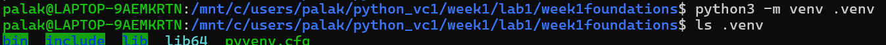
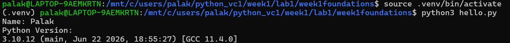
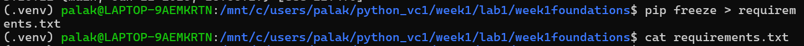
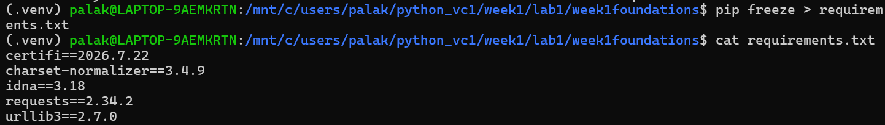

# Week 1 - Lab 1: Python Environment Setup with Virtual Environment

## Goal

Create a clean, reproducible Python project that can be easily shared and set up by anyone using a virtual environment and dependency management.

## Objective

This lab aims to build a clean and reproducible Python project by:

- Creating a Python project with a well-organized directory structure.
- Setting up and activating a Python virtual environment.
- Writing and executing a `hello.py` program to verify the Python installation and display the active Python version.
- Managing project dependencies using `pip`.
- Generating and maintaining a `requirements.txt` file.
- Configuring `.gitignore` to exclude unnecessary files such as the virtual environment.
- Learning how to recreate the same development environment on another machine.

---

## Prerequisites

- Windows with WSL (Ubuntu)
- Python 3.10 installed
- Git installed

---

## Project Structure

```
week1foundations/
│── .gitignore
│── README.md
│── hello.py
│── requirements.txt
└── .venv/
```

---

## Steps Performed

### 1. Open the project in Ubuntu (WSL)

Navigate to the project directory:

```bash
cd /mnt/c/Users/palak/python_vc1/week1/lab1/week1foundations
```

---

### 2. Update Ubuntu Packages

```bash
sudo apt update
```

---

### 3. Install Virtual Environment Package

```bash
sudo apt install python3.10-venv
```

### Issue Encountered

During installation, the following error occurred:

```
E: dpkg was interrupted, you must manually run 'sudo dpkg --configure -a'
```

### Resolution

The issue was fixed by running:

```bash
sudo dpkg --configure -a
```

After that, the installation completed successfully.

---

### 4. Create a Virtual Environment

```bash
python3 -m venv .venv
```


---

### 5. Activate the Virtual Environment

```bash
source .venv/bin/activate
```

Successful activation changes the terminal prompt to:

```text
(.venv) user@hostname:~/project$
```

---

### 6. Verify Python Installation

Create a file named `hello.py` to verify that Python is installed correctly and that the virtual environment is active.

#### Source Code

```python
import sys

print("Name: Palak Grover")
print("Python Version:")
print(sys.version)
```

#### Run the Program

```bash
python3 hello.py
```

#### Output

```text
Name: Palak Grover
Python Version:
3.10.12 (main, Jun 22 2026, 18:55:27) [GCC 11.4.0]
```


The output confirms that:
- Python is installed successfully.
- The virtual environment is active.
- The project is using Python 3.10.12.
  
---

### 7. Generate Dependency File

```bash
pip freeze > requirements.txt
```

View the contents:

```bash
cat requirements.txt
```

Initially, the file is empty because no third-party packages are installed.


---

### 8. Install a Python Package

Install the Requests library:

```bash
pip install requests
```

---

### 9. Update Requirements File

```bash
pip freeze > requirements.txt
```

The `requirements.txt` file now contains the installed package and its dependencies.


---

## Recreate the Environment

Anyone can recreate the same environment using:

```bash
python3 -m venv .venv
source .venv/bin/activate
pip install -r requirements.txt
```

---

## Files Included

- `hello.py` – Sample Python program
- `requirements.txt` – List of installed Python packages
- `.gitignore` – Ignores virtual environment and unnecessary files
- `README.md` – Documentation for this lab

---

## Key Learning Outcomes

- Installed and configured Python on Ubuntu (WSL).
- Learned how to create and activate a virtual environment.
- Resolved package installation issues using `dpkg`.
- Installed third-party Python packages using `pip`.
- Generated and maintained a `requirements.txt` file.
- Understood how to recreate the same Python environment on another machine.
