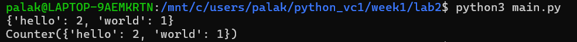
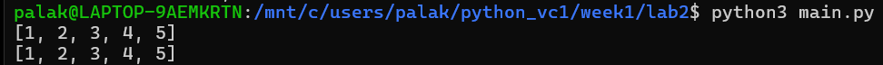
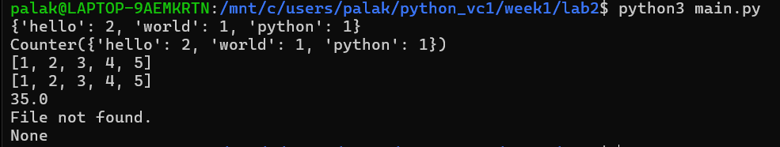

# Lab 2 - Python Fluency Drills

## Goal

Build fluency in Python by writing small, correct, and readable functions using functions, list comprehensions, `collections.Counter`, and exception handling.
## Files

- `lab2.py` – Contains all the required functions.
- `numbers.txt` – Sample input file used for calculating the mean.
- `README.md` – Documentation for the project.
- `screenshots/` – Output screenshots of each function.

## Functions Implemented

### 1. `word_count(text)`
- Converts text to lowercase.
- Removes punctuation.
- Counts the frequency of each word.
- Returns a dictionary.

### 2. `word_count_counter(text)`
- Performs the same task as `word_count()`.
- Uses `collections.Counter`.
- Produces the same output as the dictionary-based implementation.

### 3. `flatten_loop(list_of_lists)`
- Flattens a nested list using nested loops.

### 4. `flatten_comp(list_of_lists)`
- Flattens a nested list using list comprehension.

### 5. `mean_of_file(path)`
- Reads numbers from a text file.
- Ignores invalid lines using `try` and `except`.
- Returns the mean of valid numbers.
- Displays a clear message if the file does not exist.

## List Comprehension vs Generator Expression

- A list comprehension creates the entire list in memory.
- A generator expression produces values one at a time, making it more memory-efficient.
- Generator expressions are better for processing very large datasets.

## How to Run

```bash
python main.py
```

## Screenshots

The repository includes screenshots demonstrating:

- Word count using dictionary
- Word count using `collections.Counter`

- Flatten using loops
- Flatten using list comprehension

- Mean calculation from `numbers.txt`
- Missing file handled gracefully (`FileNotFoundError`)


## Sample Output

```
{'hello': 2, 'world': 1, 'python': 1}
Counter({'hello': 2, 'world': 1, 'python': 1})
[1, 2, 3, 4, 5]
[1, 2, 3, 4, 5]
35.0
File not found.
None
```
