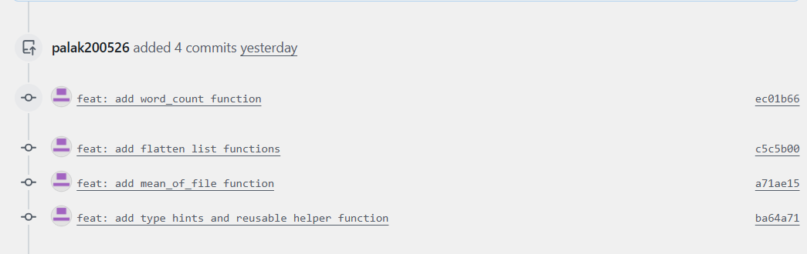
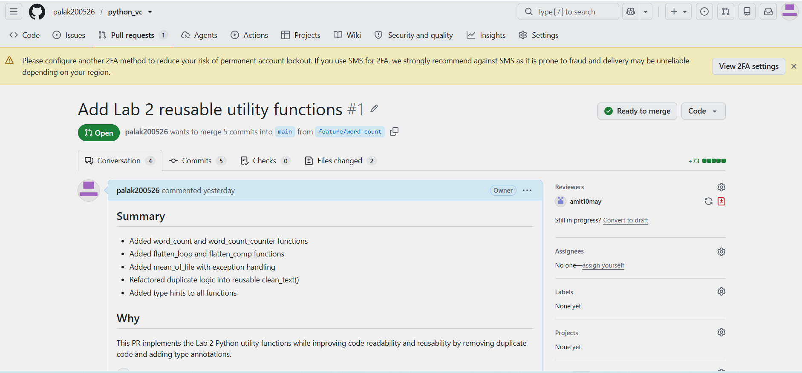
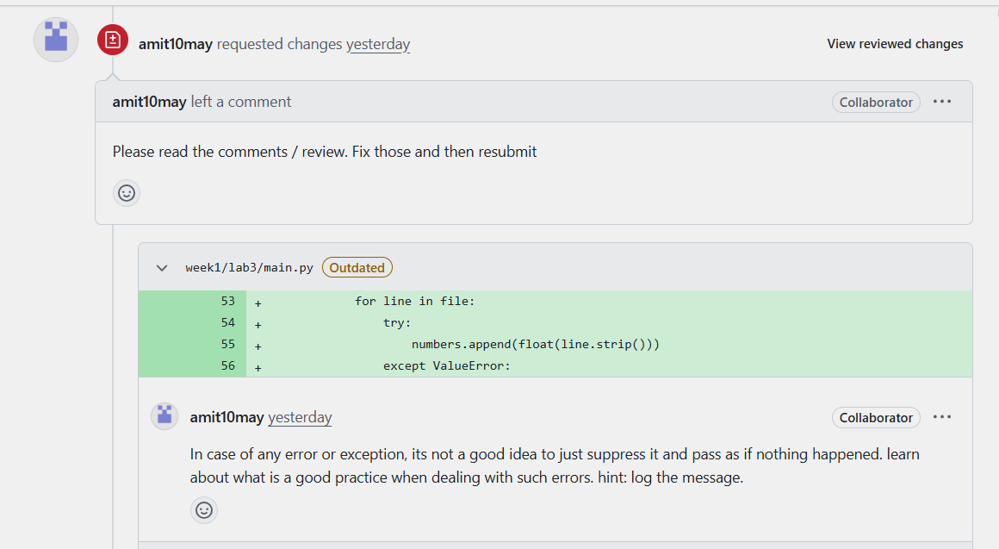
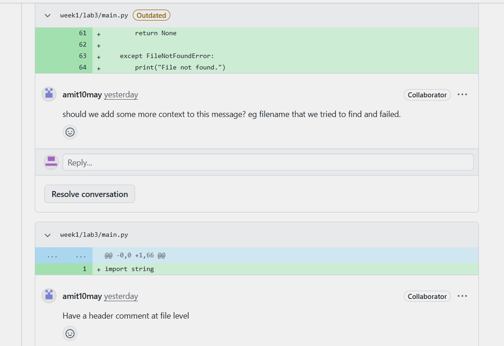
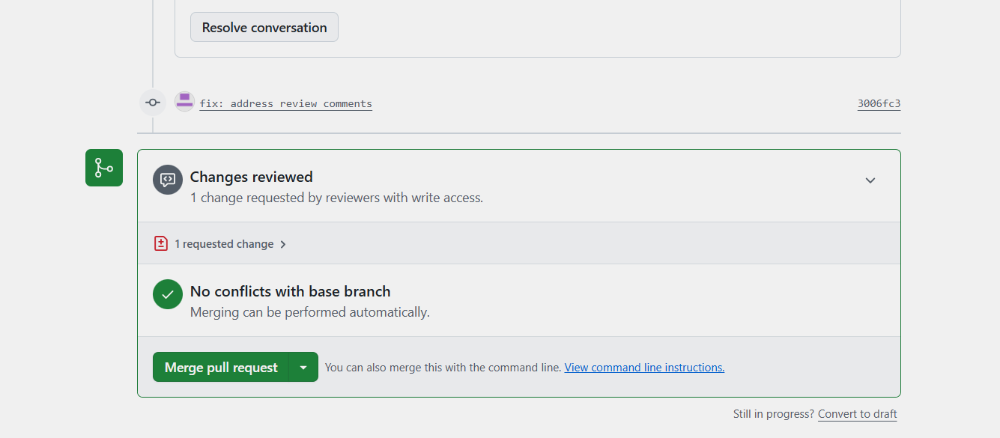
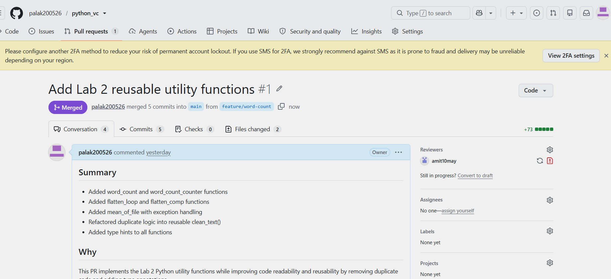
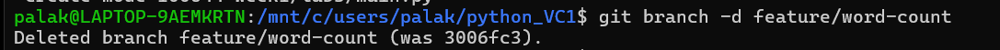

# Lab 3 – Git and GitHub Workflow

## Goal

Practice the real team workflow from branch creation to reviewed merge using Git and GitHub.

## Problem Statement

The objective of this lab is to understand and practice a professional Git and GitHub workflow. The lab involves initializing Git in a project, creating commits, working with feature branches, pushing code to GitHub, creating a pull request, responding to review comments, and merging the reviewed changes into the main branch.

## Tasks

1. Initialize Git in the project and create the first commit.
2. Create a GitHub repository and push the `main` branch.
3. Create a feature branch named `feature/word-count`.
4. Add the Lab 2 code through three or four small commits using clear Conventional Commit messages.
5. Push the feature branch to GitHub.
6. Create a Pull Request with a suitable title and description.
7. Get the Pull Request reviewed by a peer or mentor.
8. Respond to at least one review comment with a follow-up commit.
9. Merge the Pull Request into `main`.
10. Delete the feature branch after merging.
11. Complete the Introduction Sequence and Ramping Up levels on Learn Git Branching.

## Git Workflow

```text
main
  │
  └── feature/word-count
          │
          ├── feat: add word_count function
          ├── feat: add flatten list functions
          ├── feat: add mean_of_file function
          ├── feat: add type hints and reusable helper function
          └── docs: update README
                    │
                    ▼
              Pull Request
                    │
                    ▼
                 Review
                    │
                    ▼
          Follow-up Commit
                    │
                    ▼
                  Merge
                    │
                    ▼
                  main
```

## Conventional Commits

Examples of commit messages used in this lab:

```text
feat: add word_count function
feat: add flatten list function
feat: add mean_of_file function
feat: add type hints and reusable helper function
docs: update README
fix: address review comments
```



## Pull Request



### Title

**Add Lab 2 Python utility functions**

### Description

```text
## Summary

Added word_count and word_count_counter functions
Added flatten_loop and flatten_comp functions
Added mean_of_file with exception handling
Refactored duplicate logic into reusable clean_text()
Added type hints to all functions

## Why

This PR implements the Lab 2 Python utility functions while improving code readability and reusability by removing duplicate code and adding type annotations.
```

A peer or mentor reviews the Pull Request and leaves at least one comment.





### Review Comment

Example:

> Please add screenshots to the README.

After making the requested change:

```bash
git add .
git commit -m "docs: add README screenshots"
git push
```

Reply to the review comment after pushing the changes.



## Pull Request Merge

After the review was completed and the requested changes were addressed, the Pull Request was merged into the `main` branch.



## Branch Deletion

After merging the Pull Request, the `feature/word-count` branch was deleted.



## Expected Outcome

The GitHub repository should contain:

- A `main` branch
- A `feature/word-count` branch during development
- More than one meaningful commit
- A Pull Request
- At least one review comment
- A follow-up commit addressing the review
- A merged Pull Request
- The feature branch deleted after merging

## Done When

The GitHub repository shows a merged Pull Request with review comments and more than one commit, and the `main` branch contains the merged Lab 2 work.

## Capability Gained

By completing this lab, you will be able to collaborate through branches, commits, pull requests, code reviews, and merges like a team member.
