# Lab 5 – SQL Fundamentals

## Goal

## Answer real questions from a relational database using correct SQL.

## Problem Statement

The objective of this lab is to gain hands-on experience with SQL and relational databases using the Chinook SQLite database. The task involves opening the database using the SQLite3 CLI, inspecting tables and schemas, filtering and sorting data, joining related tables, grouping records, performing aggregate calculations, and using date functions. The queries are used to answer practical questions about customers, track prices, revenue, sales quantities, and monthly revenue.

---

# Step 1: Set Up SQLite

Install SQLite3 in Ubuntu/WSL.

### Commands

```bash
sudo apt update
sudo apt install sqlite3
```

### Explanation

- `sudo apt update` updates the package information.
- `sudo apt install sqlite3` installs the SQLite3 command-line tool.

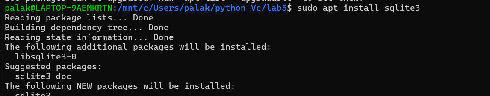

---

# Step 2: Verify SQLite Installation

Check whether SQLite3 was installed successfully.

### Command

```bash
sqlite3 --version
```

### Explanation

The command displays the installed SQLite3 version.

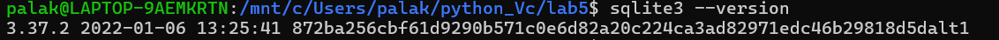

---

# Step 3: Open the Chinook Database

Open the downloaded Chinook SQLite database using the SQLite3 CLI.

### Command

```bash
sqlite3 Chinook_Sqlite.sqlite
```

### Explanation

- `sqlite3` starts the SQLite command-line interface.
- `Chinook_Sqlite.sqlite` opens the downloaded database.

---

# Step 4: Display Available Tables

View all tables present in the Chinook database.

### Command

```sql
.tables
```

### Explanation

The `.tables` command displays all tables available in the current SQLite database.

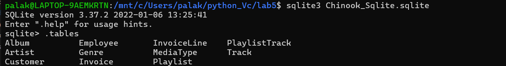

---

# Step 5: List Customers from a Given Country

The first query retrieves customers from a specified country.

### View Customer Table Schema

```sql
.schema Customer
```

### Explanation

The `.schema Customer` command displays the structure and columns of the `Customer` table.


### SQL Query

```sql
-- Insight: Retrieves all customers from the specified country.

SELECT CustomerId,
       FirstName,
       LastName,
       Email,
       Country
FROM Customer
WHERE Country = 'USA';
```

### Explanation

- `SELECT` specifies the columns to display.
- `FROM Customer` selects data from the `Customer` table.
- `WHERE Country = 'USA'` filters customers whose country is USA.

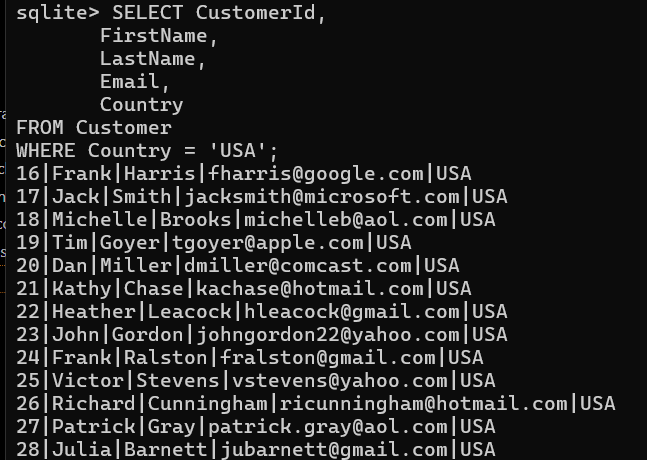

---

# Step 6: Find the 10 Most Expensive Tracks

The second query identifies the 10 tracks with the highest unit price.

### View Track Table Schema

```sql
.schema Track
```

### Explanation

The `.schema Track` command displays the structure and columns of the `Track` table.


### SQL Query

```sql
-- Insight: Displays the 10 tracks with the highest unit price.

SELECT TrackId,
       Name,
       UnitPrice
FROM Track
ORDER BY UnitPrice DESC
LIMIT 10;
```

### Explanation

- `ORDER BY UnitPrice DESC` sorts tracks from the highest price to the lowest.
- `LIMIT 10` returns only the first 10 records.

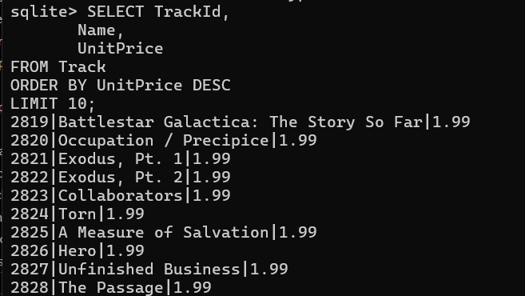

---

# Step 7: Compute Total Revenue per Country

The third query calculates the total revenue generated from customers in each country.

### View Customer Table Schema

```sql
.schema Customer
```
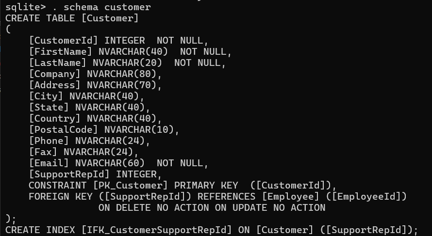

### View Invoice Table Schema

```sql
.schema Invoice
```
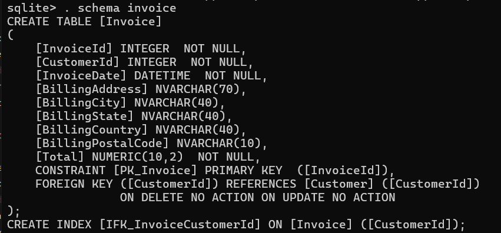

### Explanation

The `Customer` table contains customer information such as country, while the `Invoice` table contains invoice totals and `CustomerId`. The two tables can be joined using `CustomerId`.


### SQL Query

```sql
-- Insight: Calculates the total revenue generated from customers in each country.

SELECT c.Country,
       SUM(i.Total) AS TotalRevenue
FROM Customer c
JOIN Invoice i
ON c.CustomerId = i.CustomerId
GROUP BY c.Country
ORDER BY TotalRevenue DESC;
```

### Explanation

- `JOIN` connects the `Customer` and `Invoice` tables.
- `ON c.CustomerId = i.CustomerId` matches invoices with their customers.
- `SUM(i.Total)` calculates total revenue.
- `GROUP BY c.Country` groups the revenue by country.
- `ORDER BY TotalRevenue DESC` displays countries from highest to lowest revenue.

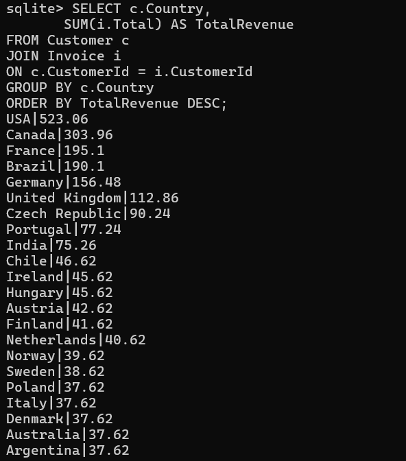

---

# Step 8: Find the 10 Best-Selling Tracks

The fourth query identifies the 10 tracks with the highest total quantity sold.

### View Track Table Schema

```sql
.schema Track
```

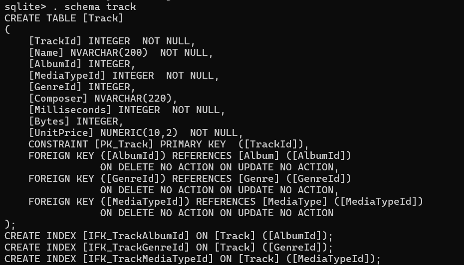

### View InvoiceLine Table Schema

```sql
.schema InvoiceLine
```
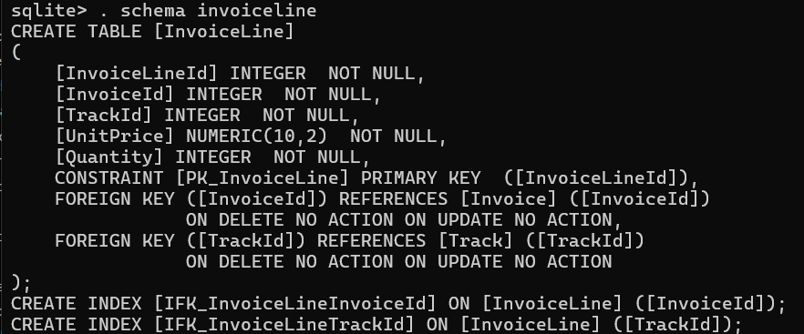

### Explanation

The `Track` table contains track information, while the `InvoiceLine` table contains the quantity of each track purchased. The tables are joined using `TrackId`.


### SQL Query

```sql
-- Insight: Identifies the 10 tracks with the highest total quantity sold.

SELECT t.TrackId,
       t.Name,
       SUM(il.Quantity) AS TotalSold
FROM Track t
JOIN InvoiceLine il
ON t.TrackId = il.TrackId
GROUP BY t.TrackId, t.Name
ORDER BY TotalSold DESC
LIMIT 10;
```

### Explanation

- `JOIN` connects `Track` with `InvoiceLine`.
- `ON t.TrackId = il.TrackId` matches each invoice item with its track.
- `SUM(il.Quantity)` calculates the total quantity sold for each track.
- `GROUP BY` groups sales by track.
- `ORDER BY TotalSold DESC` sorts tracks by quantity sold.
- `LIMIT 10` returns the top 10 tracks.

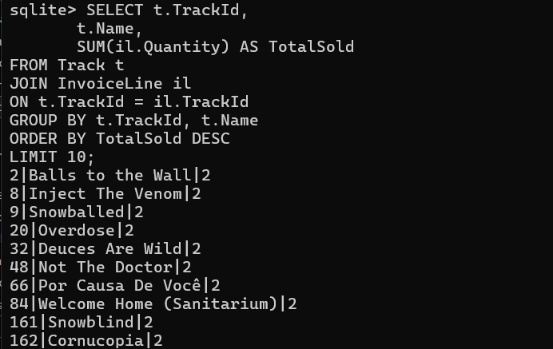

---

# Step 9: Compute Monthly Revenue for One Year

The fifth query calculates monthly revenue for the year 2012 using SQLite's `strftime()` date function.

### View Invoice Table Schema

```sql
.schema Invoice
```

### Explanation

The `Invoice` table contains the `InvoiceDate` and `Total` columns required to calculate monthly revenue.


### SQL Query

```sql
-- Insight: Calculates the monthly revenue for the selected year.

SELECT strftime('%Y-%m', InvoiceDate) AS Month,
       SUM(Total) AS TotalRevenue
FROM Invoice
WHERE strftime('%Y', InvoiceDate) = '2012'
GROUP BY Month
ORDER BY Month;
```

### Explanation

- `strftime('%Y-%m', InvoiceDate)` extracts the year and month from the invoice date.
- `SUM(Total)` calculates the total revenue for each month.
- `WHERE` filters the invoices to the year 2012.
- `GROUP BY Month` groups invoices by month.
- `ORDER BY Month` displays the months chronologically.

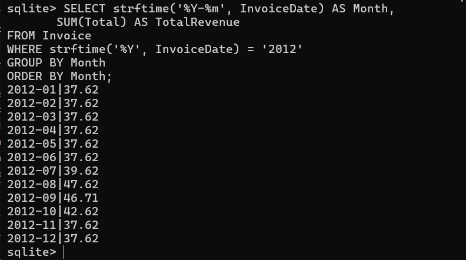

---

# Project Structure

```text
lab5/
├── Chinook_Sqlite.sqlite
├── sql/
│   ├── customer_by_country.sql
│   ├── expensive_tracks.sql
│   ├── revenue_per_country.sql
│   ├── best_selling_track.sql
│   └── monthly_revenue.sql
└── README.md
```

---

# SQL Files

Each query is stored separately in the `sql/` folder.

### `customer_by_country.sql`

Contains the query for retrieving customers from a specified country.

### `expensive_tracks.sql`

Contains the query for finding the 10 most expensive tracks.

### `revenue_per_country.sql`

Contains the query for calculating total revenue per country.

### `best_selling_track.sql`

Contains the query for finding the 10 best-selling tracks by quantity.

### `monthly_revenue.sql`

Contains the query for calculating monthly revenue for one year.

---

# Commands Used

- `sudo apt update`
- `sudo apt install`
- `sqlite3`
- `.tables`
- `.schema`
- `SELECT`
- `WHERE`
- `JOIN`
- `GROUP BY`
- `SUM`
- `ORDER BY`
- `LIMIT`
- `strftime()`

---

# Learning Outcomes

After completing this lab, I learned how to:

- Install and use SQLite3 from the Linux command line.
- Open and inspect a SQLite database.
- View available tables and table schemas.
- Filter data using `WHERE`.
- Sort data using `ORDER BY`.
- Limit query results using `LIMIT`.
- Join related tables using `JOIN`.
- Perform aggregation using `SUM`.
- Group data using `GROUP BY`.
- Extract date information using `strftime()`.
- Analyze relational data using SQL.
- Store SQL queries in separate `.sql` files with meaningful insight comments.

---

# Conclusion

This lab provided hands-on experience with SQL fundamentals using the Chinook relational database. By working with real customer, invoice, track, and sales data, I learned how to use filtering, sorting, joins, aggregation, grouping, and date functions to answer practical questions from a relational database.