# csvstat – AWS EC2 & S3 

This project extends the existing `csvstat` command-line CSV profiling tool by integrating it with **AWS EC2, Amazon S3, IAM, and Boto3**.

The main objective of this extension is to run `csvstat` on an **Amazon EC2 instance**, read CSV files stored in an **Amazon S3 bucket**, process them, and upload the generated reports back to S3.

---

# Project Objective

The objective of this project is to demonstrate how a Python application can be deployed and executed on an AWS EC2 instance while using Amazon S3 as cloud storage.

The complete workflow is:

```text
CSV File
   │
   ▼
Amazon S3
input/
   │
   │ GetObject
   ▼
Amazon EC2
   │
   │ csvstat.py
   ▼
Process CSV
   │
   ▼
Generate JSON Report
   │
   │ PutObject
   ▼
Amazon S3
output/
```

Each execution generates a new timestamped report so that previous reports are not overwritten.

---

## AWS Architecture

```text
                    AWS
                     │
          ┌──────────┴──────────┐
          │                     │
          ▼                     │
     Amazon S3                  │
   csvstat-assignment              │
          │                     │
     ┌────┴─────┐               │
     │          │               │
     ▼          ▼               │
  input/     output/            │
     │          ▲               │
     │          │               │
     ▼          │               │
  EC2 Instance ────────────────┘
     │
     │ csvstat.py
     │
     ▼
Read CSV → Process → Generate Report
```

### Workflow

1. CSV files are uploaded to the S3 `input/` prefix.
2. The EC2 instance runs `csvstat.py`.
3. `csvstat.py` reads the CSV file directly from S3 using Boto3.
4. The CSV is processed on the EC2 instance.
5. A profiling report is generated.
6. The report is uploaded to the S3 `output/` prefix.
7. Each execution generates a unique timestamped report.

---
#  Prerequisites

Before starting, make sure you have:

* An AWS account
* An AWS region selected
* An Amazon S3 bucket
* An Amazon EC2 instance
* An IAM role for EC2
* An IAM instance profile attached to the EC2 instance
* Python 3
* pip
* Git
* AWS CLI
* The GitHub repository containing this project
* A CSV file for testing

This guide uses:

```text
AWS Region: ap-south-1
```

---

# AWS Services Used

## Amazon EC2

The application runs on an EC2 instance.

The EC2 instance is responsible for:

* Hosting the project repository
* Running Python
* Running `csvstat.py`
* Reading CSV files from S3
* Generating reports
* Uploading reports to S3

---


# IAM Permissions

The EC2 instance uses an **IAM instance profile** with the role `ec2Assignment`.

The role follows the principle of least privilege and provides only the S3 permissions required by the application.

Required permissions:

```text
s3:ListBucket
s3:GetObject
s3:PutObject
```

The permissions are restricted to:

```text
{
  "Version": "2012-10-17",
  "Statement": [
    {
      "Effect": "Allow",
      "Action": "s3:ListBucket",
      "Resource": "arn:aws:s3:::csvstat-assignment"
    },
    {
      "Effect": "Allow",
      "Action": "s3:GetObject",
      "Resource": "arn:aws:s3:::csvstat-assignment/input/*"
    },
    {
      "Effect": "Allow",
      "Action": "s3:PutObject",
      "Resource": "arn:aws:s3:::csvstat-assignment/output/*"
    }
  ]
}
```

The EC2 instance does not use hardcoded AWS access keys or secret keys. Boto3 obtains temporary credentials through the attached IAM instance profile.

---

# Boto3 Integration

The AWS extension uses **Boto3**, the AWS SDK for Python.

Install the dependency using:

```bash
pip3 install -r requirements.txt
```

The `requirements.txt` file contains:

```text
boto3==1.42.97
```

Boto3 is responsible for communicating with Amazon S3.

The application uses the EC2 IAM instance profile to authenticate with AWS.

---

# Environment Versions

The application was tested using the following environment:

```text
Python: 3.9.25
pip: 21.3.1
Git: 2.50.1
Boto3: 1.42.97
AWS Region: ap-south-1
```
---


# AWS EC2 & S3 Setup

## 1. Create the S3 Bucket

Go to **AWS Console → S3 → Create bucket**.

Configure:

* **Bucket name:** `csvstat-assignment`
* **Region:** `ap-south-1`
* Keep other settings as default.

The bucket will be:

```text
s3://csvstat-assignment/
```
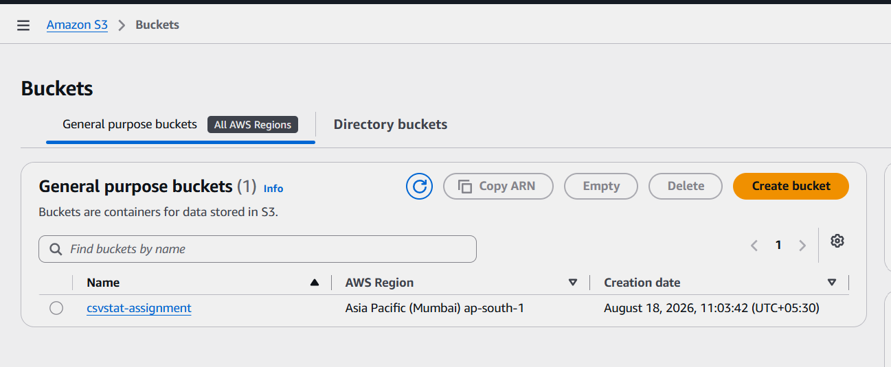

## 2. Create S3 Folders

Inside the bucket, create:

```text
csvstat-assignment/
├── input/
└── output/
```

* `input/` → CSV files
* `output/` → Generated JSON reports

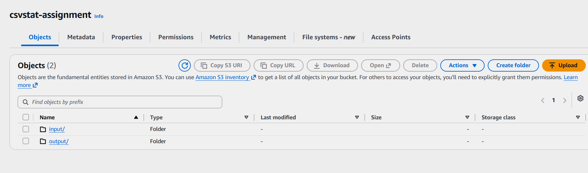

## 3. Upload CSV File

Upload `test1.csv` to the `input/` folder.

```text
s3://csvstat-assignment/input/test1.csv
```

Verify using:

```bash
aws s3 ls s3://csvstat-assignment/input/
```
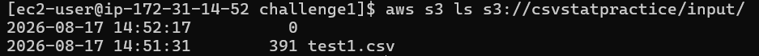

## 4. Create IAM Policy

Go to **IAM → Policies → Create policy → JSON** and add:

```json
{
  "Version": "2012-10-17",
  "Statement": [
    {
      "Effect": "Allow",
      "Action": "s3:ListBucket",
      "Resource": "arn:aws:s3:::csvstat-assignment"
    },
    {
      "Effect": "Allow",
      "Action": "s3:GetObject",
      "Resource": "arn:aws:s3:::csvstat-assignment/input/*"
    },
    {
      "Effect": "Allow",
      "Action": "s3:PutObject",
      "Resource": "arn:aws:s3:::csvstat-assignment/output/*"
    }
  ]
}
```

Create it as:

```text
csvstat-s3-access
```
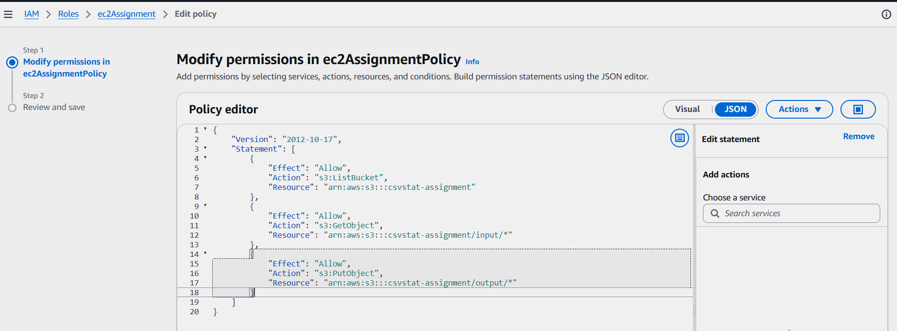

## 5. Create IAM Role

Go to **IAM → Roles → Create role**.

* Trusted entity: **AWS service**
* Use case: **EC2**
* Attach: `csvstat-s3-access`
* Role name: `ec2Assignment`

The EC2 instance uses this role to access S3 without storing AWS access keys.
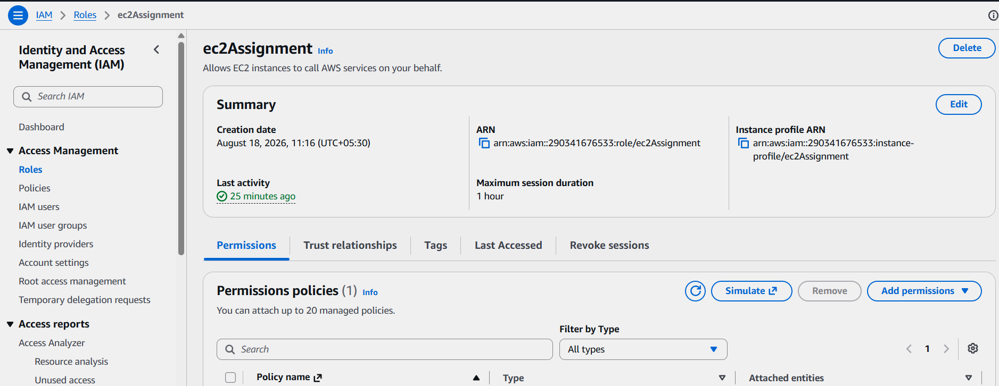

## 6. Launch EC2 Instance

Go to **EC2 → Instances → Launch instance**.

Configure:

* **Name:** `csvstat-ec2`
* **AMI:** Amazon Linux
* **Instance type:** suitable/free-tier eligible instance
* **Key pair:** create/select a `.pem` key
* **SSH:** allow from **My IP**
* **IAM role:** `ec2Assignment`

Launch the instance.
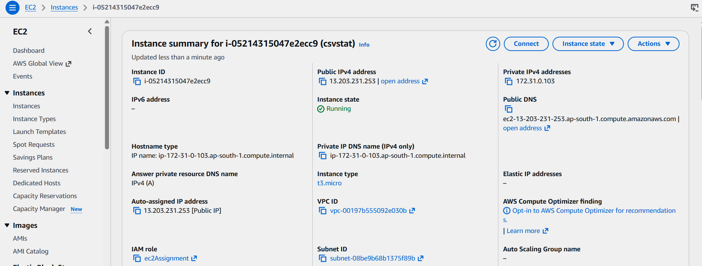

## 7. Connect to EC2

After the instance is running:

```bash
ssh -i <key-file>.pem ec2-user@<EC2_PUBLIC_IP>
```
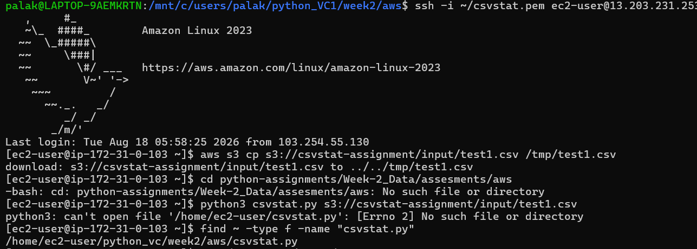

Verify the environment:

```bash
python3 --version
pip3 --version
git --version
aws --version
```
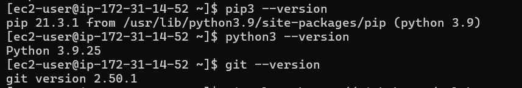

## 8. Clone the Project

```bash
git clone https://github.com/palak200526/python_vc.git
cd python_vc/week2/aws
```
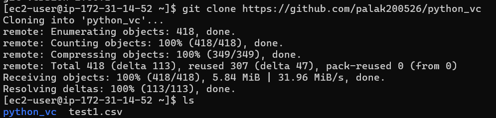

Verify:

```bash
ls
```

Expected files:

```text
csvstat.py
requirements.txt
README.md
```

## 9. Install Dependencies

```bash
pip3 install -r requirements.txt
```

`requirements.txt` contains:

```text
boto3==1.42.97
```

## 10. Verify IAM Authentication

Run:

```bash
aws sts get-caller-identity
```
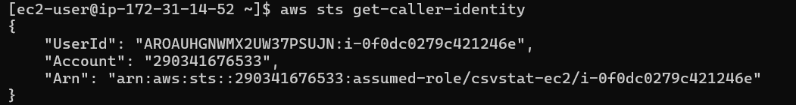

The response should show the `ec2Assignment` assumed role.

## 11. Verify S3 Access

```bash
aws s3 ls s3://csvstat-assignment/input/
```

Expected:

```text
test1.csv
```


## 12. Run csvstat

```bash
python3 csvstat.py s3://csvstat-assignment/input/test1.csv
```

The application:

```text
S3 → Read CSV → Process → Generate JSON → Upload to S3
```

The report is uploaded to:

```text
s3://csvstat-assignment/output/
```

## 13. Verify Output

```bash
aws s3 ls s3://csvstat-assignment/output/
```
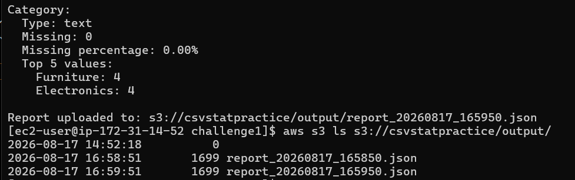

Example:

```text
report_20260817_165850.json
```

This confirms that the application successfully reads the CSV from S3 and uploads the generated JSON report back to S3.

# Conclusion

This project extends the existing `csvstat` application with an AWS-based execution and storage workflow.

The application runs on **Amazon EC2**, uses **Amazon S3** for input and output storage, uses **Boto3** for S3 communication, and uses an **IAM instance profile** for secure AWS authentication.

The final workflow is:

```text
CSV in S3
   ↓
EC2
   ↓
csvstat.py
   ↓
Generate Report
   ↓
Upload to S3
   ↓
Report in output/
```

This extension demonstrates the integration of a Python application with core AWS services while following a secure IAM-based authentication approach.
