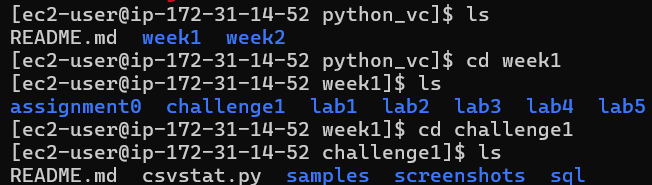
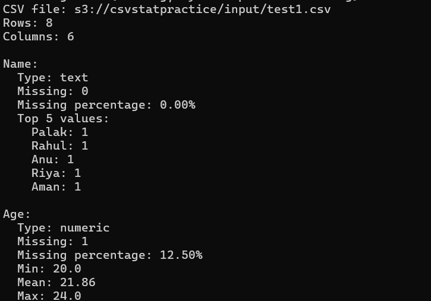

# csvstat – AWS EC2 & S3 

This project extends the existing `csvstat` command-line CSV profiling tool by integrating it with **AWS EC2, Amazon S3, IAM, and Boto3**.

The main objective of this extension is to run `csvstat` on an **Amazon EC2 instance**, read CSV files stored in an **Amazon S3 bucket**, process them, and upload the generated reports back to S3.

---

## AWS Architecture

```text
                    AWS
                     │
          ┌──────────┴──────────┐
          │                     │
          ▼                     │
     Amazon S3                  │
   csvstat-assignment              │
          │                     │
     ┌────┴─────┐               │
     │          │               │
     ▼          ▼               │
  input/     output/            │
     │          ▲               │
     │          │               │
     ▼          │               │
  EC2 Instance ────────────────┘
     │
     │ csvstat.py
     │
     ▼
Read CSV → Process → Generate Report
```

### Workflow

1. CSV files are uploaded to the S3 `input/` prefix.
2. The EC2 instance runs `csvstat.py`.
3. `csvstat.py` reads the CSV file directly from S3 using Boto3.
4. The CSV is processed on the EC2 instance.
5. A profiling report is generated.
6. The report is uploaded to the S3 `output/` prefix.
7. Each execution generates a unique timestamped report.

---

# AWS Services Used

## Amazon EC2

The application runs on an EC2 instance.

The EC2 instance is responsible for:

* Hosting the project repository
* Running Python
* Running `csvstat.py`
* Reading CSV files from S3
* Generating reports
* Uploading reports to S3

---

## Amazon S3

Amazon S3 is used as the storage layer for input CSV files and generated reports.

### Current Bucket

```text
csvstat-assignment
```

### AWS Region

```text
ap-south-1
```

### S3 Structure

```text
s3://csvstat-assignment/
│
├── input/
│   └── test1.csv
│
└── output/
    ├── report_20260817_165850.json
    └── report_20260817_165950.json
```

### Input

CSV files are stored in:

```text
s3://csvstat-assignment/input/
```

### Output

Generated reports are stored in:

```text
s3://csvstat-assignment/output/
```

---

# IAM Instance Profile

The EC2 instance accesses S3 using an **IAM instance profile**.

### IAM Role

```text
ec2Assignment
```

The role provides the permissions required by the application to interact with the S3 bucket.

The application does **not** store AWS access keys or secret keys.

Boto3 obtains temporary credentials automatically through the EC2 instance profile.

This provides a more secure approach than hardcoding AWS credentials inside the application.

---

# IAM Permissions

The EC2 instance uses an **IAM instance profile** with the role `ec2Assignment`.

The role follows the principle of least privilege and provides only the S3 permissions required by the application.

Required permissions:

```text
s3:ListBucket
s3:GetObject
s3:PutObject
```

The permissions are restricted to:

```text
s3:ListBucket
    → arn:aws:s3:::csvstat-assignment

s3:GetObject
    → arn:aws:s3:::csvstat-assignment/input/*

s3:PutObject
    → arn:aws:s3:::csvstat-assignment/output/*
```

The EC2 instance does not use hardcoded AWS access keys or secret keys. Boto3 obtains temporary credentials through the attached IAM instance profile.

---

# Boto3 Integration

The AWS extension uses **Boto3**, the AWS SDK for Python.

Install the dependency using:

```bash
pip3 install -r requirements.txt
```

The `requirements.txt` file contains:

```text
boto3==1.42.97
```

Boto3 is responsible for communicating with Amazon S3.

The application uses the EC2 IAM instance profile to authenticate with AWS.

---

# EC2 Setup

## 1. Connect to EC2

For Amazon Linux:

```bash
ssh -i <key-file>.pem ec2-user@13.203.231.253>
```


## 2. Verify Python

```bash
python3 --version
```

## 3. Verify Git

```bash
git --version
```
## 4. Install Dependencies

```bash
pip3 install -r requirements.txt
```


## 5. Clone the Repository

```bash
git clone <repository-url>
```


Navigate to the project directory:

```bash
cd python_vc
```

Navigate to the directory containing `csvstat.py`:

```bash
cd python_vc/week2/aws
```


---

# Verify IAM Access

Verify the IAM identity attached to the EC2 instance:

```bash
aws sts get-caller-identity
```


The response should show the `ec2Assignment` IAM role.

Test access to the S3 input directory:

```bash
aws s3 ls s3://csvstat-assignment/input/
```


Example:

```text
test1.csv
```

Test the output directory:

```bash
aws s3 ls s3://csvstat-assignment/output/
```

---

# Running the Application

The application accepts an S3 URI as input.

Example:

```bash
python3 csvstat.py s3://csvstat-assignment/input/test1.csv
```


The application follows this workflow:

```text
S3 Input
   ↓
Read CSV
   ↓
Process CSV
   ↓
Generate Report
   ↓
Upload Report
   ↓
S3 Output
```

Example output:

```text
Report uploaded to:
s3://csvstat-assignment/output/report_20260817_165850.json
```

---

# Generated Reports

Reports are stored in the S3 `output/` prefix.

Example:

```text
s3://csvstat-assignment/output/report_20260817_165850.json
s3://csvstat-assignment/output/report_20260817_165950.json
```


A timestamp is included in the filename so that every execution creates a new report instead of overwriting the previous one.

---

# Verification

After running the application:

```bash
aws s3 ls s3://csvstat-assignment/output/
```

Example:

```text
2026-08-17 16:58:51  1699 report_20260817_165850.json
2026-08-17 16:59:51  1699 report_20260817_165950.json
```

A generated report can also be downloaded for verification:

```bash
aws s3 cp s3://csvstat-assignment/output/REPORT_NAME.json .
```

---


# Conclusion

This project extends the existing `csvstat` application with an AWS-based execution and storage workflow.

The application runs on **Amazon EC2**, uses **Amazon S3** for input and output storage, uses **Boto3** for S3 communication, and uses an **IAM instance profile** for secure AWS authentication.

The final workflow is:

```text
CSV in S3
   ↓
EC2
   ↓
csvstat.py
   ↓
Generate Report
   ↓
Upload to S3
   ↓
Report in output/
```

This extension demonstrates the integration of a Python application with core AWS services while following a secure IAM-based authentication approach.
