# Week 2 EDA — Titanic Dataset

## Overview

This project performs an end-to-end Exploratory Data Analysis (EDA) on the Titanic dataset.

The purpose of this analysis is to understand the structure and quality of the dataset, clean the available data, identify important patterns, and extract meaningful insights that can be communicated to a stakeholder.

The analysis focuses on:

- Data profiling
- Missing-value analysis
- Data cleaning
- Duplicate and data-type checks
- Outlier analysis
- Feature engineering
- Exploratory visualization
- Deeper analysis
- Key insight extraction
- Data-quality and modeling risks

---

## Objective

The main objectives of this project are to:

- Understand the structure and characteristics of the dataset.
- Identify missing values and other data-quality issues.
- Clean the dataset using appropriate and explainable decisions.
- Explore relationships between passenger characteristics and survival.
- Identify three important and non-obvious findings.
- Identify potential data-quality and modeling risks.
- Prepare a concise stakeholder-oriented summary of the findings.

---

## Requirements

The project requires Python and the following main libraries:

- pandas
- numpy
- matplotlib
- seaborn
- jupyter

All dependencies are listed in:

```text
requirements.txt
```

---

## Project Structure

```text
week2-eda/
│
├── README.md
├── requirements.txt
├── .gitignore
├── eda.ipynb
├── summary.md
│
└── data/
    └── titanic.csv
```

---

## Dataset

The analysis uses the **Titanic dataset from Kaggle**.

The dataset contains information about passengers aboard the Titanic, including:

- Passenger class
- Gender
- Age
- Number of siblings and spouses aboard
- Number of parents and children aboard
- Ticket fare
- Port of embarkation
- Survival status

The raw dataset is not committed to this repository.

For running the notebook locally, place the dataset at:

```text
data/titanic.csv
```

---

## Analysis Workflow

The EDA follows the workflow below:

```text
Load Dataset
     ↓
Data Profiling
     ↓
Missing-Value Analysis
     ↓
Data Cleaning
     ↓
Outlier Analysis
     ↓
Feature Engineering
     ↓
Exploratory Visualization
     ↓
Deeper Analysis
     ↓
Key Insights
     ↓
Data Quality & Modeling Risks
     ↓
Stakeholder Summary
```

---

## Data Profiling

The dataset was profiled before performing the cleaning process.

The profiling includes:

- Dataset shape
- Column names
- Column data types
- Summary statistics
- Missing-value counts
- Missing-value percentages
- Duplicate records
- Numerical and categorical variables

This provides an initial understanding of the dataset and helps identify potential data-quality issues.

---

## Data Cleaning

The following cleaning decisions were made during the analysis.

### Missing `Age` Values

Missing `Age` values were replaced using the median age.

**Rationale:** Median imputation preserves the available passenger records and is less affected by extreme values than mean imputation.
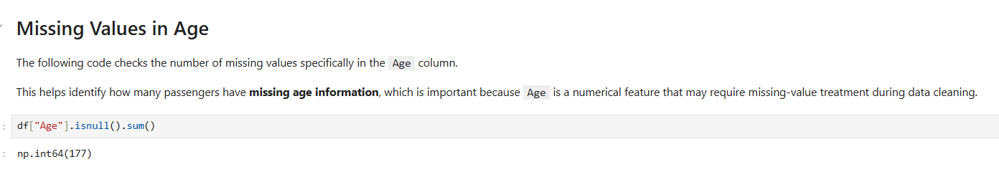

### Missing `Embarked` Values

Missing `Embarked` values were replaced using the mode.

**Rationale:** `Embarked` is a categorical variable, so the most frequently occurring category provides a simple and appropriate replacement for the small number of missing values.
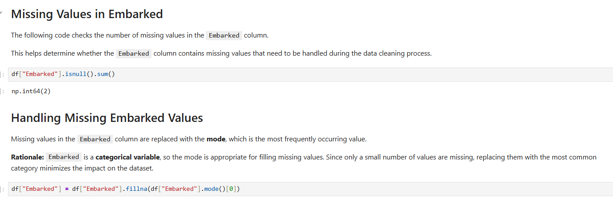

### `Cabin` Missingness

The `Cabin` column contained a high proportion of missing values.

A `CabinKnown` indicator was created to retain information about whether a cabin value was available. The original `Cabin` column was then removed from the cleaned analysis dataset.

**Rationale:** The high level of missingness makes individual cabin values unreliable for direct analysis, while the indicator preserves useful information about cabin availability.
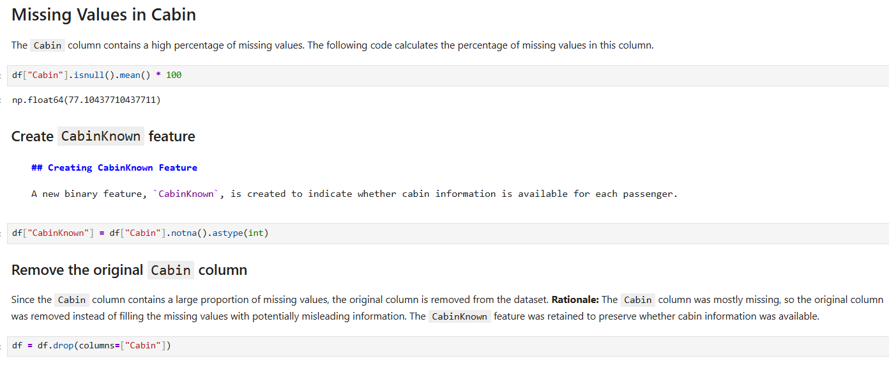

### Duplicate Records

Duplicate records were checked during the cleaning process.

**Rationale:** Duplicate observations can distort counts, summary statistics, and survival-rate calculations.


### Data Types

Column data types were reviewed and categorical variables were handled appropriately for analysis.

**Rationale:** Correct data types improve the reliability of calculations, grouping, and visualization.
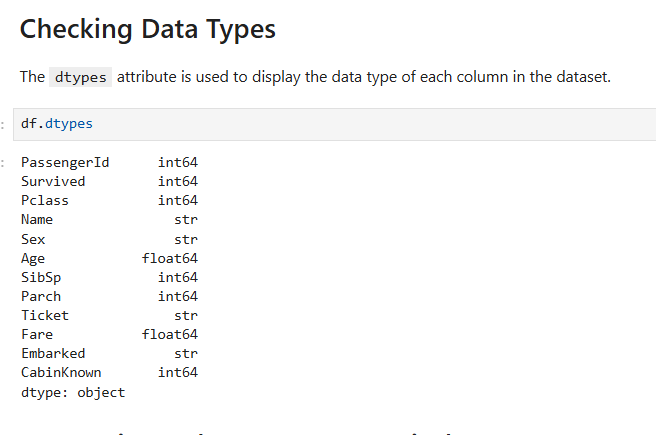

---

## Outlier Analysis

Numerical variables such as `Age` and `Fare` were reviewed for potential outliers.

High-value `Fare` observations were retained.

**Rationale:** These observations may represent legitimate ticket prices rather than data-entry errors. Removing them without sufficient evidence could result in the loss of valid observations.
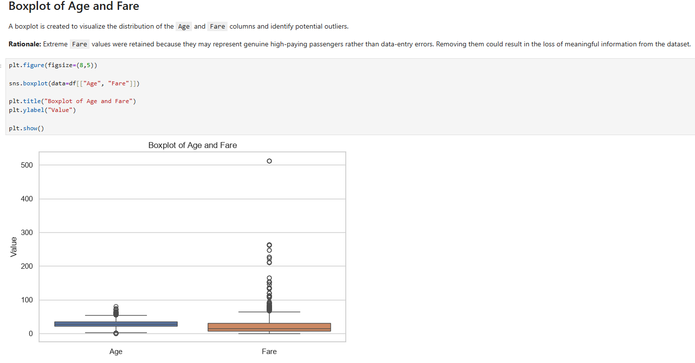
---

## Feature Engineering

Additional features were created to support deeper analysis.

### `FamilySize`

The `FamilySize` feature was calculated as:

```text
FamilySize = SibSp + Parch + 1
```

This represents the total family group size associated with each passenger.
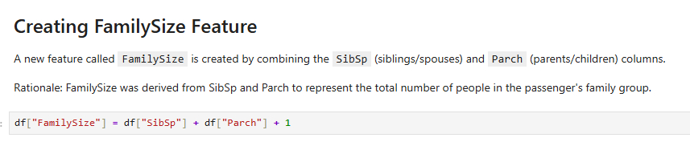

### `FamilyGroup`

Passengers were grouped into three broader categories:

- `Alone`
- `Small`
- `Large`

This makes the relationship between family grouping and survival easier to interpret and reduces the influence of very small individual family-size categories.


### `AgeGroup`

Passengers were grouped into the following age categories:

- `Child`
- `Teen`
- `Adult`
- `Middle-aged`
- `Senior`

This allows survival patterns to be compared across broader age groups.

---

## Exploratory Visualization

The analysis includes visualizations that answer specific questions about passenger survival.

### Gender and Survival

**Question:** Does survival differ by gender?

The analysis shows a substantial difference in survival between female and male passengers, with female passengers having a much higher survival rate.
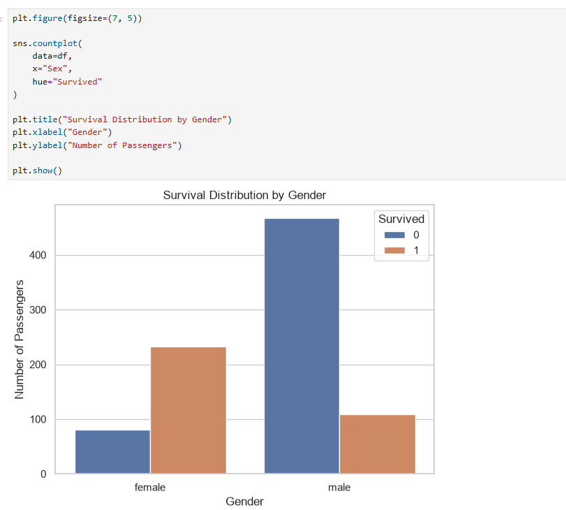

### Passenger Class and Survival

**Question:** Does passenger class affect survival?

Survival rates differed substantially across passenger classes. First-class passengers generally had higher survival rates than second- and third-class passengers.
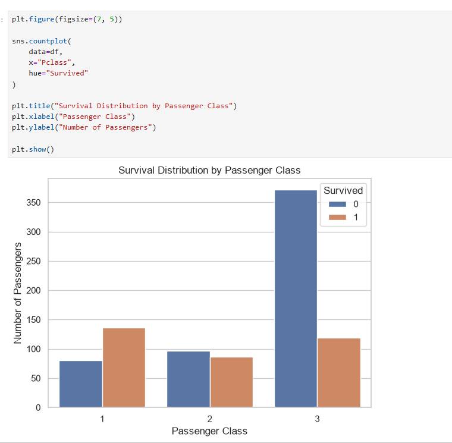

### Age and Survival

**Question:** How does age relate to survival?

The age distributions of survivors and non-survivors were compared to identify differences in survival patterns across passenger ages.
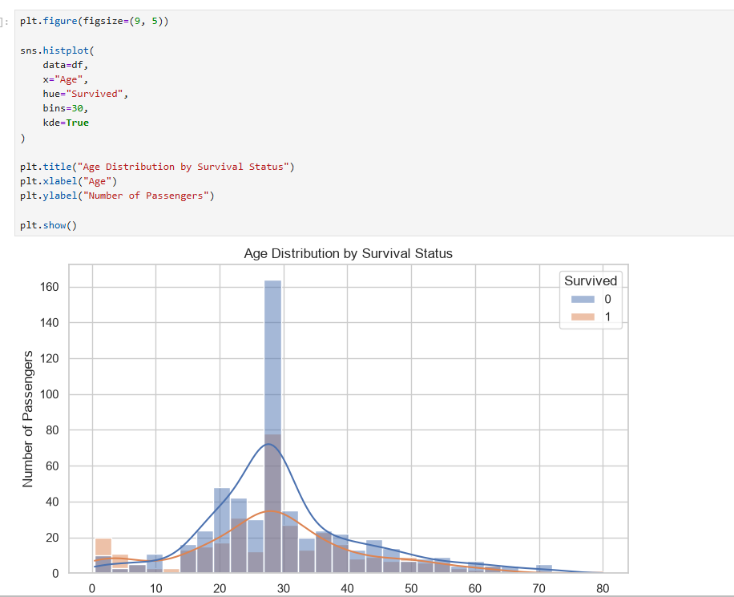

### Fare and Survival

**Question:** Does fare differ between survivors and non-survivors?

Fare distributions were compared between passengers who survived and passengers who did not survive.
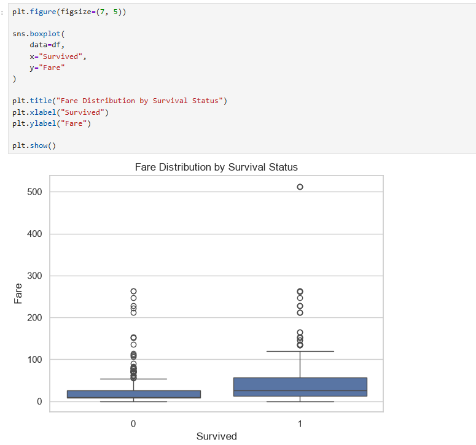

### Family Size and Survival

**Question:** How does family size relate to survival?

The analysis showed a non-linear relationship between family size and survival.
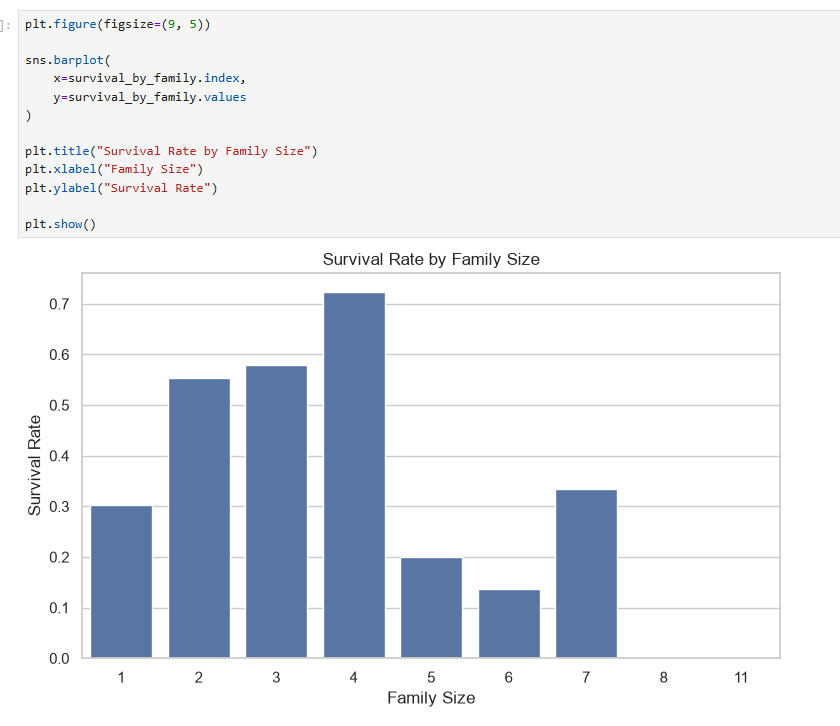

### Gender and Passenger Class

**Question:** Does the relationship between gender and survival change across passenger classes?

The analysis showed that gender and passenger class together produced substantial differences in survival.

| Passenger Group | Survival Rate |
|---|---:|
| 1st-class female | **96.8%** |
| 2nd-class female | **92.1%** |
| 3rd-class female | **50.0%** |
| 1st-class male | **36.9%** |
| 2nd-class male | **15.7%** |
| 3rd-class male | **13.5%** |

### Age and Passenger Class

**Question:** Does passenger class remain important across different age groups?

Passenger class remained strongly associated with survival across comparable age groups.

First-class passengers generally had higher survival rates than lower-class passengers.

Some age/class combinations contained relatively few observations, so individual subgroup percentages should be interpreted cautiously.


---

## Key Insights

### 1. Gender and Passenger Class Were Strongly Associated With Survival

Female passengers had higher survival rates than male passengers in every passenger class.

However, passenger class also changed the survival rate within each gender.

The highest observed survival rate was among first-class females at **96.8%**, while third-class males had a survival rate of **13.5%**.

This shows that examining gender or passenger class separately does not capture the complete survival pattern.

---

### 2. Small Family Groups Had Better Survival Outcomes

Survival did not increase or decrease consistently with every individual family size.

After grouping passengers into broader family categories:

- **Small family groups:** approximately 58% survival
- **Traveling alone:** approximately 30% survival
- **Large family groups:** approximately 16% survival

This indicates a non-linear relationship between family grouping and survival.

Passengers traveling in small family groups had better survival outcomes than passengers traveling alone or in large family groups.

---

### 3. Passenger Class Remained Important Across Age Groups

Passenger class continued to show a strong association with survival when age groups were considered.

First-class passengers generally had higher survival rates than lower-class passengers within comparable age groups.

Some age/class subgroups contained relatively few observations, so their survival rates should be interpreted cautiously.

---

## Interpretation & Limitations

The strongest findings are the patterns that remain consistent across multiple comparisons.

In particular:

- Gender is strongly associated with survival.
- Passenger class is strongly associated with survival.
- The combination of gender and passenger class separates passengers into substantially different survival groups.
- Small family groups show better survival outcomes than passengers traveling alone or in large groups.

These findings describe **associations rather than causal relationships**. Individual subgroup percentages should also be interpreted in the context of their sample sizes, particularly when a subgroup contains relatively few observations.

---

## Data Quality & Modeling Risks

### Target Leakage

`Survived` is the target variable and must not be included as an input feature when building a model to predict survival.

### Identifier Risk

`PassengerId` is an identifier rather than a meaningful passenger characteristic and should generally be excluded from predictive modeling.

### High Missingness in `Cabin`

The `Cabin` column contains substantial missingness, which limits the reliability of analyses based directly on individual cabin values.

### Age Imputation

Missing `Age` values were replaced with the median.

While this preserves observations, median imputation reduces variation in the imputed values and may influence model results.

### Small Subgroups

Some combinations of variables contain relatively few passengers.

For example, survival rates for specific age and passenger-class groups may appear unusually high or low simply because the subgroup contains few observations.

### Potential Outliers

High-value `Fare` observations were reviewed as potential outliers but were retained because they may represent legitimate ticket prices rather than data-entry errors.

---


## Conclusion

The EDA shows that **gender and passenger class were strongly associated with survival**, with their combination producing substantial differences in survival outcomes.

Small family groups also showed better survival outcomes than passengers traveling alone or in large groups.

The analysis highlights several data-quality considerations, including missing values, high missingness in `Cabin`, small subgroups, potential outliers, and modeling risks such as target leakage and identifier variables.

These findings provide a foundation for further analysis while emphasizing the importance of careful interpretation of cleaned data and subgroup-level results.