# Pandas Fundamentals
# Pandas Lab 1

## Overview

This lab focuses on practicing fundamental data manipulation and analysis operations using the Pandas library in Python.

The lab uses a student dataset containing information such as study time, attendance, sleep hours, parental education, previous grades, final exam scores, and final grades.

## Objectives

The main objectives of this lab are:

- Load datasets using Pandas
- Inspect and understand DataFrame structure
- Check the number of rows and columns
- Select specific rows and columns
- Filter rows using conditions
- Apply multiple filtering conditions
- Create new calculated columns
- Group categorical data and aggregate numerical data
- Create and merge DataFrames using a common key
- Verify the resulting data and row counts

## Technologies Used

- Python
- Pandas
- Jupyter Notebook

## Datasets

### 1. Business Dataset

The `business.xlsx` file is an Excel dataset used to practice loading, inspecting, selecting, and filtering data using Pandas.

Operations performed on this dataset include:

- Loading an Excel file using `pd.read_excel()`
- Displaying the first few rows
- Inspecting dataset information
- Generating statistical summaries
- Checking the shape and number of rows
- Selecting specific columns
- Selecting rows and columns using `loc`
- Selecting rows and columns using `iloc`
- Converting a column to numeric values
- Filtering values based on a condition

### 2. Student Dataset

The `student.csv` file is used to practice data filtering, calculated columns, grouping, aggregation, and other Pandas operations.

The dataset contains information such as:

- `student_id`
- `gender`
- `study_time_hours`
- `attendance_percent`
- `sleep_hours`
- `parental_education`
- `internet_access`
- `extracurricular_activities`
- `part_time_job`
- `previous_grade`
- `final_exam_score`
- `final_grade`

The student dataset contains **1000 rows and 12 columns** before the additional `Average Grade` column is created.

## Lab Tasks

## Task 1: Load and Inspect a CSV Dataset

In this task, a CSV file is loaded into a Pandas DataFrame and basic inspection operations are performed to understand the dataset.

The following Pandas functions are used:

- `pd.read_ex()` – Loads the CSV file into a DataFrame.
- `head()` – Displays the first five rows of the dataset.
- `info()` – Displays information about columns, data types, and non-null values.
- `describe()` – Provides a statistical summary of numerical columns.
- `shape` – Returns the number of rows and columns in the DataFrame.

### Implementation

The `read_excel()` function is used to read the Excel file, and the data is stored in the variable `df` for further analysis and manipulation.

### Command Used

```python
import pandas as pd

df = pd.read_excel("business.xlsx")
```
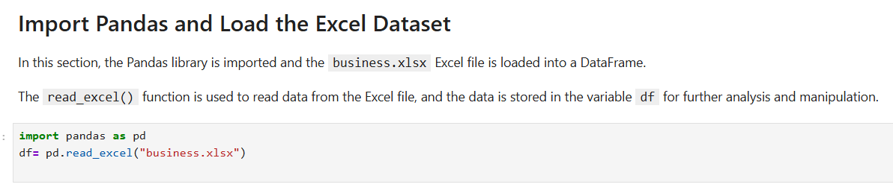

## Display the First Five Rows

The `head()` function is used to display the first five rows of the DataFrame.

It provides a quick overview of the dataset and helps us understand the structure and type of data stored in each column.

### Command Used

```python
df.head()
```
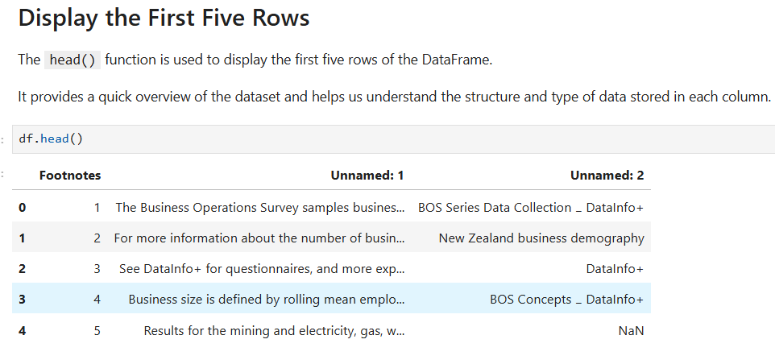

## Display Dataset Information

The `info()` function provides a concise summary of the DataFrame.

It displays the column names, number of non-null values, data types, and memory usage of the dataset. This helps us understand the structure of the DataFrame and identify missing values.

### Command Used

```python
df.info()
```
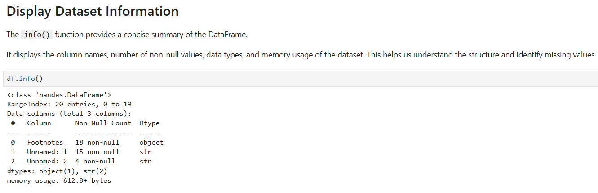

## Statistical Summary of the Dataset

The `describe()` function provides a statistical summary of the columns in the DataFrame.

It displays values such as count, unique values, most frequent value (`top`), and frequency (`freq`). This helps us understand the basic characteristics of the dataset.

### Command Used

```python
df.describe()
```
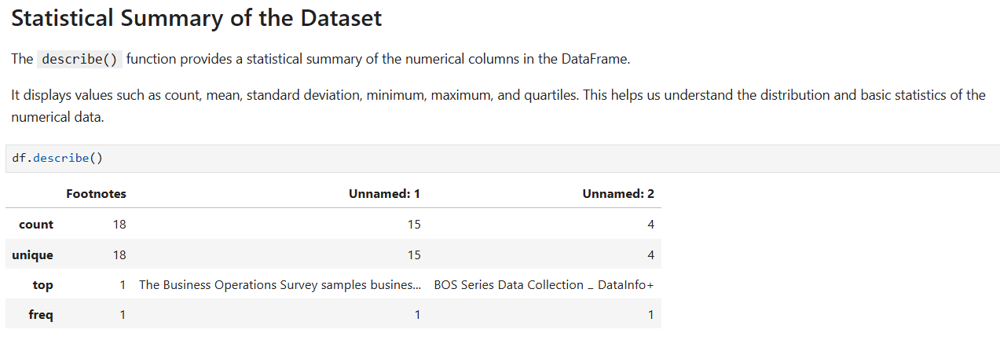

## Check the Shape of the Dataset

The `shape` attribute returns the dimensions of the DataFrame.

It shows the number of rows and columns in the form `(rows, columns)`.

In this dataset, the shape is `(20, 3)`, which means the DataFrame contains **20 rows and 3 columns**.

### Command Used

```python
df.shape
```
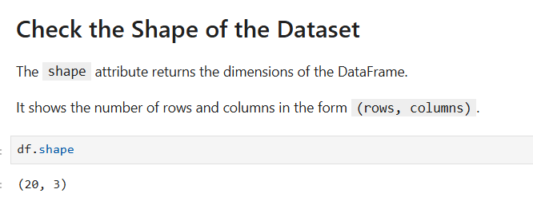

## Task 2: Select Columns and Rows Using loc and iloc and Filter Rows

In this task, specific columns and rows are selected from the DataFrame using `loc` and `iloc`. Rows are also filtered using a Boolean condition.

The following Pandas operations are used:

- `df[["column1", "column2"]]` – Selects specific columns from the DataFrame.
- `loc` – Selects rows and columns using labels or index values.
- `iloc` – Selects rows and columns using integer positions.
- Boolean condition – Filters rows based on a specified condition.

## Select Specific Columns

Specific columns can be selected by providing their column names inside a list.

### Command Used

```python
df[["Footnotes", "Unnamed: 1"]]
```
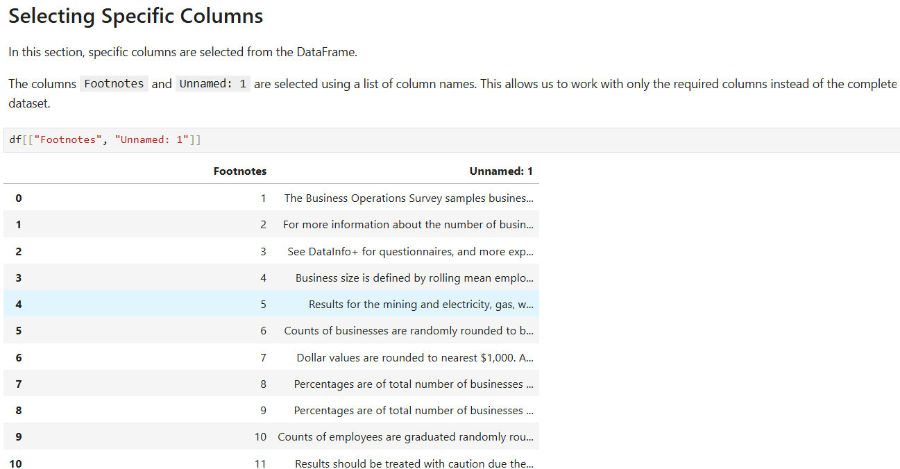

## Select Rows and Columns Using loc

The loc method is used to select specific rows and columns using their labels.

### Command Used

```python
df.loc[0:15, ["Footnotes", "Unnamed: 1"]]
```
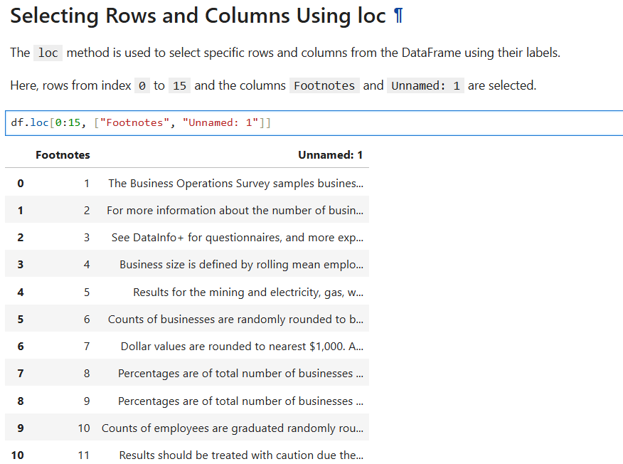

### Select Rows and Columns Using loc

The loc method is used to select specific rows and columns using their labels.

### Command Used

```python
df.iloc[0:8, 1:3]
```
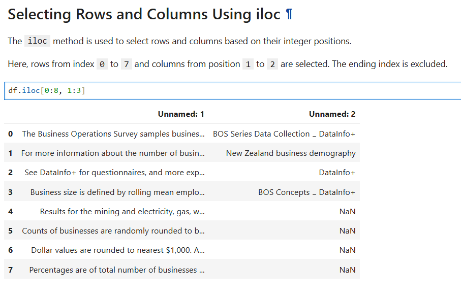

## Filter Rows Using a Boolean Condition

Rows can be filtered by applying a Boolean condition to a column.

### Command Used

```python
df["Footnotes"]= pd.to_numeric(df["Footnotes"], errors="coerce")
print(df["Footnotes"]>5)
```
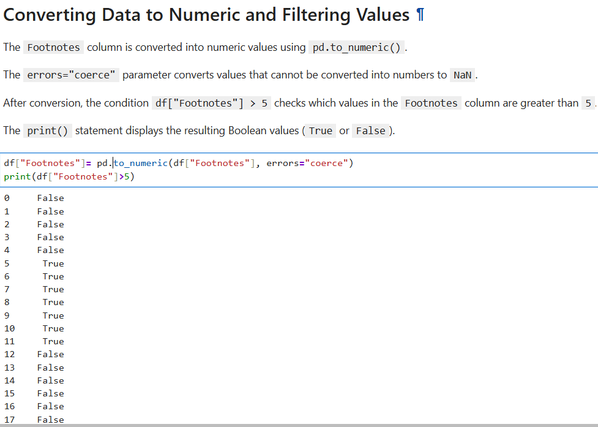

## Task 3: Create a New Column Derived from Existing Ones

In this task, a new column is created by performing a calculation using existing columns in the DataFrame.

## Load the Student Dataset

In this section, the `student.csv` file is loaded into a Pandas DataFrame using the `read_csv()` function.

The dataset is stored in the variable `df`, which will be used for further data analysis and manipulation.

### Command Used

```python
df = pd.read_csv("student.csv")
```
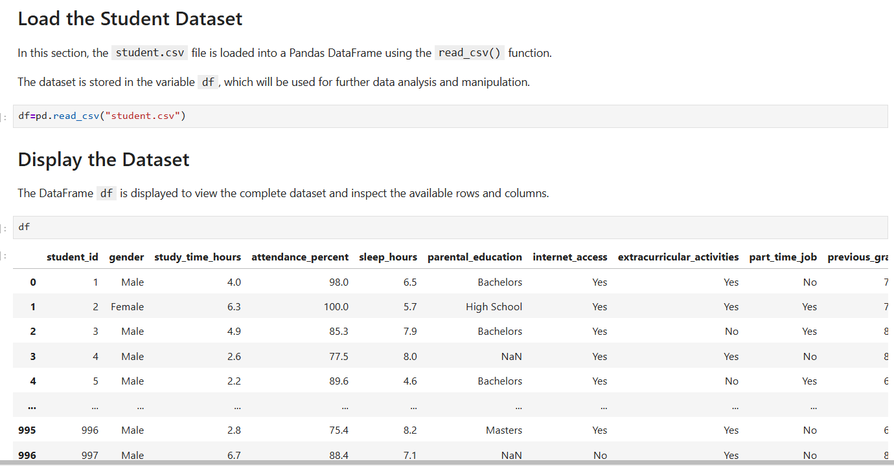

## Create a New Column Derived from Existing Columns

A new column named Average Grade is created using the existing previous_grade and final_exam_score columns.

The average of these two columns is calculated for each student and stored in the new Average Grade column.

### Command Used
```
df["Average Grade"] = (
    df["previous_grade"] + df["final_exam_score"]
) / 2
```
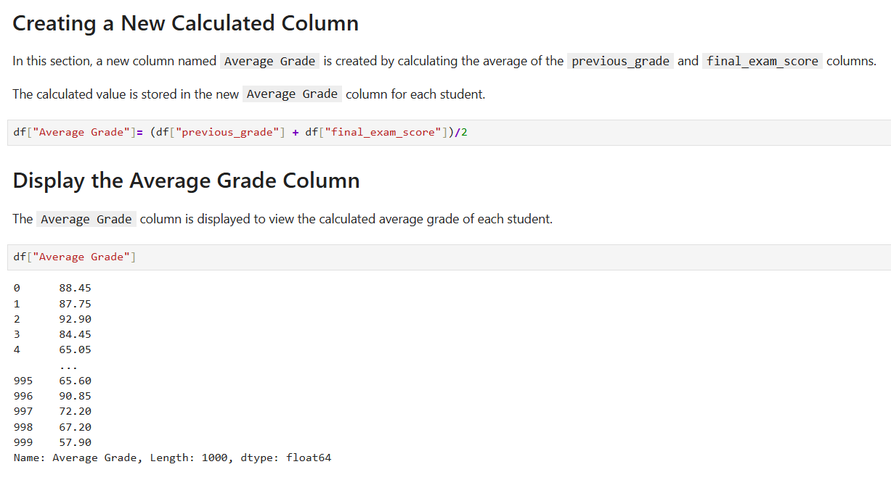

## Task 4: Group by a Categorical Column and Aggregate a Numeric Column

In this task, the DataFrame is grouped by the categorical column `part_time_job`, and the numerical column `study_time_hours` is aggregated.

The `mean` function is used to calculate the average study time for each group, while the `count` function calculates the number of students in each group.

### Command Used

```python
result = df.groupby("part_time_job")["study_time_hours"].agg(["mean", "count"])

print(result)
```
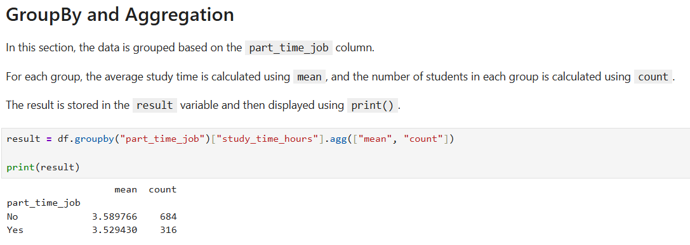

## Task 5: Merge Two DataFrames on a Key and Confirm the Resulting Row Count

In this task, two DataFrames are created and merged using a common key, `student_id`.

The `pd.merge()` function is used to combine the two DataFrames based on matching `student_id` values. The resulting row count is then checked using the `len()` function to confirm that the merge produces the expected number of records.

## Creating a DataFrame

In this section, a new DataFrame named `df1` is created using a dictionary.

The DataFrame contains two columns: `student_id` and `name`, with three student records.

### Command Used

```python
df1 = pd.DataFrame({
    "student_id": [1, 2, 3],
    "name": ["James", "John", "Mary"]
})

print(df1)
```
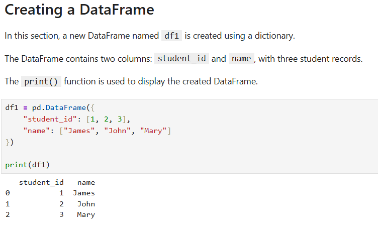

## Creating a Second DataFrame

In this section, a second DataFrame named df2 is created using a dictionary.

The DataFrame contains two columns: student_id and marks. The student_id column is used as the common key for merging the two DataFrames.

### Command Used

```python
df2 = pd.DataFrame({
    "student_id": [1, 2, 3],
    "marks": [85, 90, 78]
})

print(df2)
```
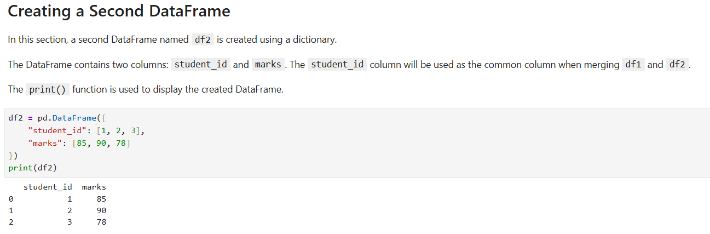

## Merging Two DataFrames

The two DataFrames df1 and df2 are merged using the common student_id column.

The merged DataFrame contains the student_id, name, and marks columns.

### Command Used
```python
result = pd.merge(df1, df2, on="student_id")


print(result)
```
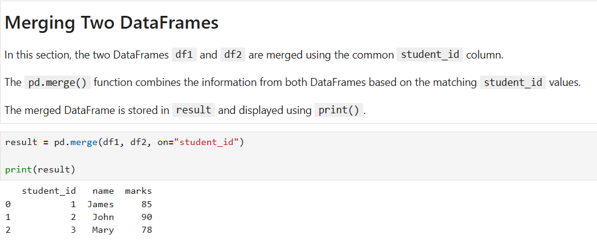

## Checking Row Counts After Merging

The number of rows in df1, df2, and the merged DataFrame result is checked using the len() function.

Since both DataFrames contain three matching student_id values, the merged DataFrame also contains three rows.

### Command Used
```python
print("df1 rows:", len(df1))
print("df2 rows:", len(df2))
print("Merged rows:", len(result))
```
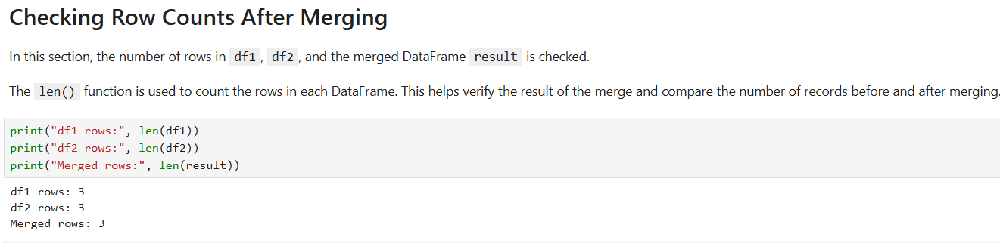

## Conclusion

This lab provided practical experience with the fundamental operations of the Pandas library in Python. We learned how to load and inspect CSV and Excel datasets, select rows and columns using `loc` and `iloc`, filter data using Boolean conditions, and create new columns from existing data.

The lab also demonstrated how to group categorical data and perform numerical aggregations such as `mean` and `count`. Finally, we created and merged two DataFrames using a common key and verified the resulting row count.

Overall, this lab helped build a strong foundation in data manipulation and analysis using Pandas.
