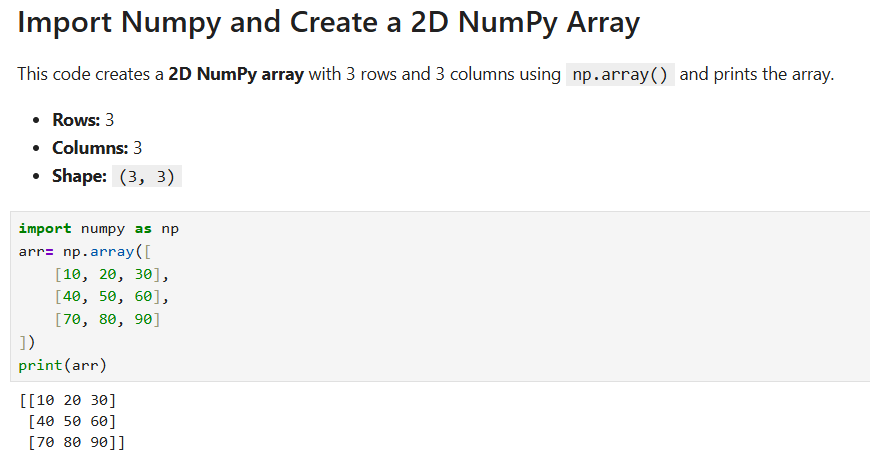
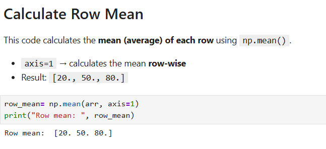
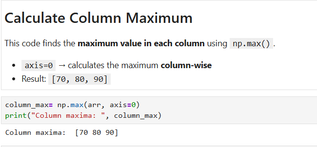
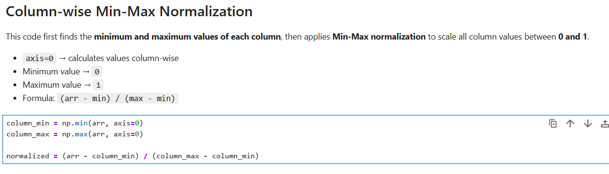
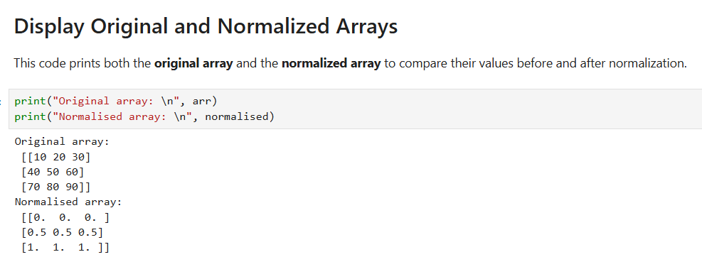
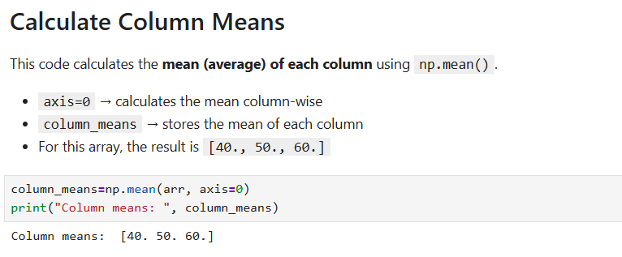
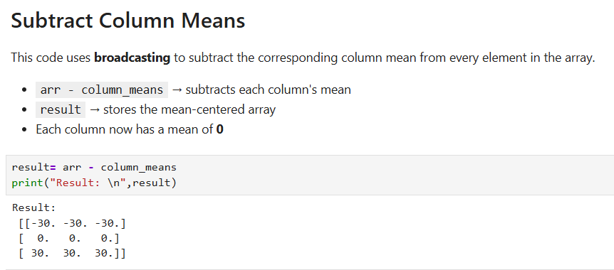
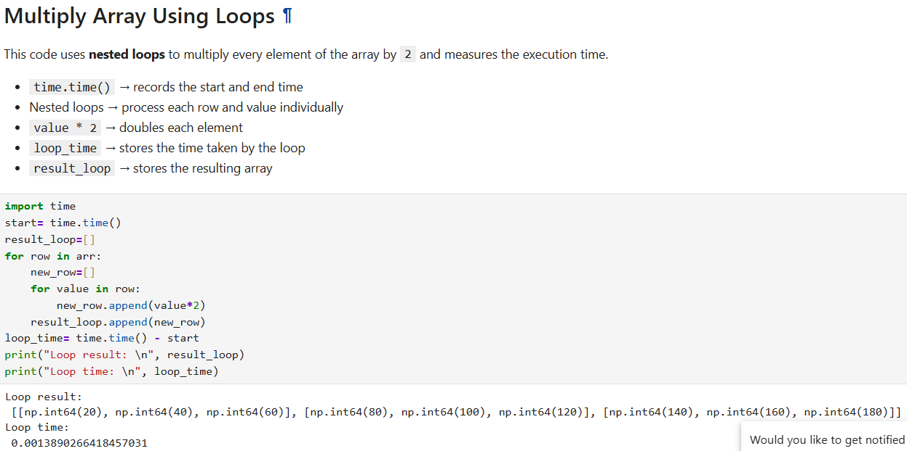
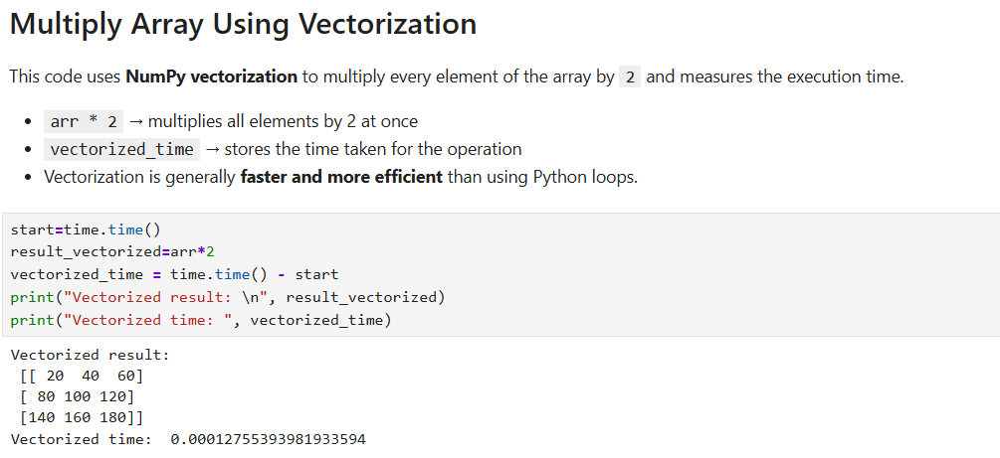
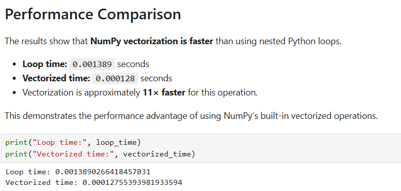

# NumPy and Vectorization
# NumPy Lab 2
## Overview

This lab focuses on practicing fundamental array manipulation and vectorized operations using the NumPy library in Python.

The lab demonstrates how NumPy can be used to perform calculations on complete arrays without explicitly writing Python loops. It covers creating 2D arrays, calculating row and column statistics, normalizing columns, broadcasting operations, and comparing the performance of vectorized operations with equivalent Python loops.

## Objectives

The main objectives of this lab are:

- Create and work with 2D NumPy arrays
- Calculate row-wise means
- Calculate column-wise maximum values
- Normalize each column to the range 0 to 1
- Use broadcasting to perform operations across rows and columns
- Subtract column means from every row
- Compare vectorized NumPy operations with Python loops
- Understand the performance benefits of vectorization
- Explain broadcasting in NumPy

## Technologies Used
- Python
- NumPy
- Jupyter Notebook

## Dataset

This lab uses a manually created 2D NumPy array for demonstrating array operations.

The array contains numerical values arranged in rows and columns.

Example Array
import numpy as np

arr = np.array([
    [10, 20, 30],
    [40, 50, 60],
    [70, 80, 90]
])

print(arr)


## Lab Tasks
## Task 1: Create a 2D NumPy Array and Compute Row Means and Column Maxima

In this task, a 2D NumPy array is created and basic statistical operations are performed on the rows and columns.

The following NumPy operations are used:

np.array() – Creates a NumPy array.
np.mean() – Calculates the mean of array elements.
np.max() – Finds the maximum value.
axis=0 – Performs the operation column-wise.
axis=1 – Performs the operation row-wise.

## Create a 2D NumPy Array

A 2D NumPy array is created using the np.array() function.

## Command Used
```python
import numpy as np

arr = np.array([
    [10, 20, 30],
    [40, 50, 60],
    [70, 80, 90]
])

print(arr)
```



## Calculate Row Means

The np.mean() function with axis=1 is used to calculate the mean of each row.

## Command Used
```python
row_means = np.mean(arr, axis=1)

print("Row means:", row_means)
```



## Calculate Column Maximums

The np.max() function with axis=0 is used to find the maximum value from each column.

## Command Used
```python
column_max = np.max(arr, axis=0)

print("Column maximums:", column_max)

```



## Task 2: Normalize Each Column to the Range 0 to 1

In this task, each column of the NumPy array is normalized so that its minimum value becomes 0 and its maximum value becomes 1.

The normalization formula used is:

**normalized = (x - column_min) / (column_max - column_min)**

The minimum and maximum values are calculated for each column using NumPy functions.

## Calculate Column Minimum and Maximum
Command Used
```python
column_min = np.min(arr, axis=0)
column_max = np.max(arr, axis=0)
```

## Normalize the Columns

The column minimum and maximum arrays are used directly in the calculation without using a Python loop.

Command Used
```python
normalized = (
    arr - column_min
) / (column_max - column_min)
```




Command Used
```python
print("Column minimum:", column_min)
print("Column maximum:", column_max)
```




The normalized array is:

[[0.  0.  0. ]
 [0.5 0.5 0.5]
 [1.  1.  1. ]]

This operation demonstrates vectorization, because the calculation is performed on the entire array instead of processing each value individually using a loop.

## Task 3: Use Broadcasting to Subtract Column Means from Every Row

In this task, the mean of each column is calculated and then subtracted from every row of the array.

## Calculate Column Means

The np.mean() function with axis=0 calculates the mean of each column.

Command Used
```python
column_means = np.mean(arr, axis=0)

print("Column means:", column_means)
```



For the given array, the column means are:

[40. 50. 60.]
Subtract Column Means

The column means are subtracted from the complete array.

Command Used
```python
result = arr - column_means

print(result)
```



The result is:

[[-30. -30. -30.]
 [  0.   0.   0.]
 [ 30.  30.  30.]]

NumPy automatically applies the one-dimensional column_means array to every row of the 2D array.

## Broadcasting

Broadcasting allows NumPy to automatically perform operations between arrays with compatible shapes without explicitly writing loops.

For example:

10 20 30       40 50 60
40 50 60   -   40 50 60
70 80 90       40 50 60

The same column means are automatically subtracted from each row.

## Task 4: Compare Vectorized Operation with an Equivalent Python Loop

In this task, the same operation is performed using two different approaches:

- A Python for loop
- A NumPy vectorized operation

The execution time of both approaches is measured and compared.

## Operation Using a Python Loop

A Python loop is used to multiply every element of the array by 2.

Command Used
```python
import time

start = time.time()

result_loop = []

for row in arr:
    new_row = []

    for value in row:
        new_row.append(value * 2)

    result_loop.append(new_row)

loop_time = time.time() - start

print("Loop result:")
print(result_loop)

print("Loop time:", loop_time)
```


## Operation Using NumPy Vectorization

The same operation is performed using NumPy without an explicit loop.

Command Used
```python
start = time.time()

result_vectorized = arr * 2

vectorized_time = time.time() - start

print("Vectorized result:")
print(result_vectorized)

print("Vectorized time:", vectorized_time)
```



The vectorized operation produces the same result as the Python loop but performs the operation directly on the entire NumPy array.

## Performance Comparison

The execution times of the loop-based and vectorized operations are compared.

Command Used
```python
print("Loop time:", loop_time)
print("Vectorized time:", vectorized_time)
```



For a small array, the difference in execution time may be very small. However, for large arrays, NumPy vectorized operations are generally much faster than equivalent Python loops.

## Concepts Learned

This lab demonstrates the following important NumPy concepts:

- Creating 2D NumPy arrays
- Row-wise operations using axis=1
- Column-wise operations using axis=0
- Calculating means and maximum values
- Column normalization
- Vectorization
- Broadcasting
- Performance comparison between loops and NumPy operations

# Conclusion

This lab demonstrates how NumPy can perform numerical operations efficiently using vectorized array operations. Instead of explicitly writing Python loops, operations such as normalization and subtraction can be performed directly on complete arrays.

The lab also demonstrates broadcasting, which allows NumPy to perform operations between arrays of compatible shapes automatically. Vectorized NumPy operations are generally more efficient than Python loops, especially when working with large datasets.