# Data Cleaning

# Lab 3

## Overview

This lab focuses on cleaning and preparing a messy cafe sales dataset using the Pandas library in Python.

The dataset contains transaction-level information about cafe sales, including transaction ID, item purchased, quantity, price per unit, total amount spent, payment method, location, and transaction date.

The dataset intentionally contains common data-quality problems such as missing values, `UNKNOWN` values, `ERROR` values, incorrect data types, and potential outliers. The purpose of this lab is to identify these problems, apply appropriate cleaning strategies, and verify that the final dataset is consistent and suitable for analysis.

## Objectives

The main objectives of this lab are:

* Load and inspect the cafe sales dataset
* Profile missing values by count and percentage
* Identify `UNKNOWN` and `ERROR` values
* Choose an appropriate cleaning strategy for each column
* Convert numerical columns from text to numeric data types
* Convert the transaction date column to a proper date type
* Identify duplicate records
* Detect and evaluate obvious outliers
* Justify each data-cleaning decision
* Validate the final cleaned DataFrame
* Confirm that the cleaned data contains sensible values and no unexpected missing values

## Technologies Used

* Python
* Pandas
* Jupyter Notebook

## Dataset

The `dirty_cafe_sales.csv` file contains **10,000 rows and 8 columns**.

The columns in the dataset are:

* `Transaction ID`
* `Item`
* `Quantity`
* `Price Per Unit`
* `Total Spent`
* `Payment Method`
* `Location`
* `Transaction Date`

### Dataset Description

| Column             | Description                   | Data Type After Cleaning |
| ------------------ | ----------------------------- | ------------------------ |
| `Transaction ID`   | Unique transaction identifier | Object                   |
| `Item`             | Cafe item purchased           | Object                   |
| `Quantity`         | Number of items purchased     | Numeric                  |
| `Price Per Unit`   | Price of one item             | Numeric                  |
| `Total Spent`      | Total transaction amount      | Numeric                  |
| `Payment Method`   | Method used for payment       | Object                   |
| `Location`         | Transaction location          | Object                   |
| `Transaction Date` | Date of transaction           | Datetime                 |

## Lab Tasks

## Task 1: Profile Missingness Per Column


In this task, the dataset is inspected to determine how many missing values are present in each column.

### Load the Dataset

The CSV file is loaded using the `read_csv()` function.

### Command Used

```python
import pandas as pd

df = pd.read_csv("dirty_cafe_sales.csv")

print(df.head())
```

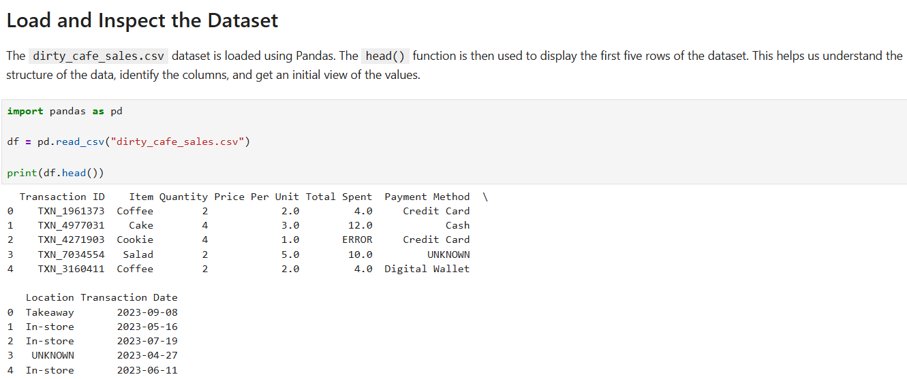

### Check Dataset Shape

The `shape` attribute is used to determine the number of rows and columns.

```python
print("Rows:", df.shape[0])
print("Columns:", df.shape[1])
```

The dataset contains:

```text
Rows: 10000
Columns: 8
```

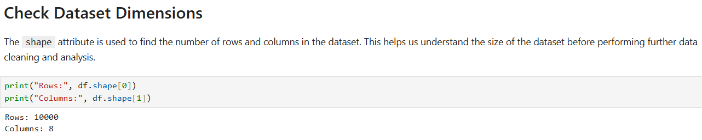

### Check Missing Values

The `isnull().sum()` function is used to calculate the number of missing values in each column.

```python
missing_count = df.isnull().sum()

print(missing_count)
```

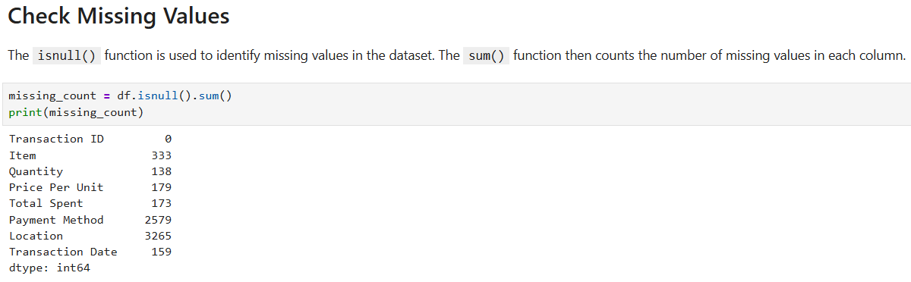


### Calculate Missing Percentage

The percentage of missing values is calculated using the total number of rows.

```python
missing_percentage = (df.isnull().sum() / len(df)) * 100

print(missing_percentage)
```

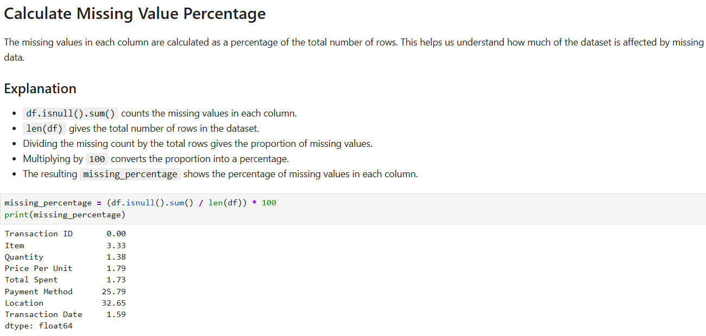

This shows that `Location` has the highest percentage of missing values at **32.65%**, followed by `Payment Method` at **25.79%**.


## Task 2: Choose and Apply a Missing-Value Strategy

Missing values are not the only problem in the dataset. Several columns also contain text values such as `UNKNOWN` and `ERROR`.

These values need to be treated as invalid or missing values before further analysis.

### Check UNKNOWN and ERROR Values

The following command was used to check the frequency of values in each column:

```python
for column in df.columns:
    print("\n", column)
    print(df[column].value_counts(dropna=False).head(15))
```

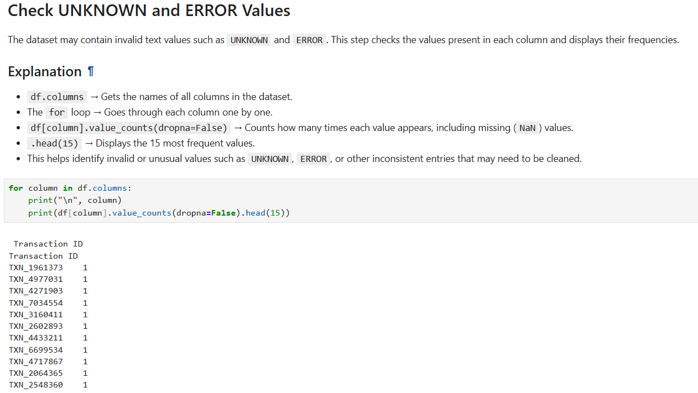

The check identified invalid values in the following columns:

* `Item`: `UNKNOWN`, `ERROR`
* `Quantity`: `UNKNOWN`, `ERROR`
* `Price Per Unit`: `UNKNOWN`, `ERROR`
* `Total Spent`: `ERROR`
* `Payment Method`: `UNKNOWN`, `ERROR`
* `Location`: `UNKNOWN`, `ERROR`
* `Transaction Date`: `UNKNOWN`, `ERROR`

### Replace UNKNOWN and ERROR With Missing Values

The invalid text values were replaced with Pandas' missing-value representation `pd.NA`.

```python
df = df.replace(["UNKNOWN", "ERROR"], pd.NA)
```

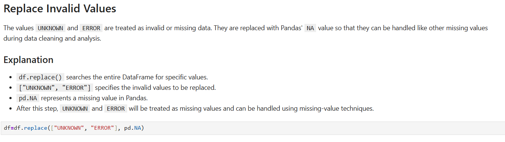

### Verify the Replacement

After replacing the invalid values, the dataset was checked again to confirm that `UNKNOWN` and `ERROR` were no longer treated as valid values.

```python
for column in df.columns:
    print("\n", column)
    print(df[column].value_counts(dropna=False).head(15))
```

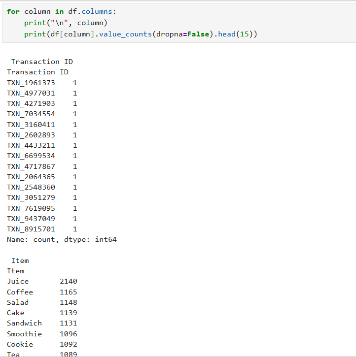

### Apply Missing-Value Strategies

After converting `UNKNOWN` and `ERROR` into missing values, appropriate strategies were applied to the columns based on their data type and the amount of missing data.

#### Numerical Columns

`Quantity`, `Price Per Unit`, and `Total Spent` were converted to numeric values and missing values were imputed using the median.

```python
df["Quantity"] = pd.to_numeric(df["Quantity"], errors="coerce")
df["Quantity"] = df["Quantity"].fillna(df["Quantity"].median())

df["Price Per Unit"] = pd.to_numeric(
    df["Price Per Unit"], errors="coerce"
)
df["Price Per Unit"] = df["Price Per Unit"].fillna(
    df["Price Per Unit"].median()
)

df["Total Spent"] = pd.to_numeric(
    df["Total Spent"], errors="coerce"
)
df["Total Spent"] = df["Total Spent"].fillna(
    df["Total Spent"].median()
)
```

#### Categorical Columns

`Item` and `Payment Method` were categorical columns, so their missing values were replaced with the mode.

```python
df["Item"] = df["Item"].fillna(df["Item"].mode()[0])

df["Payment Method"] = df["Payment Method"].fillna(
    df["Payment Method"].mode()[0]
)
```

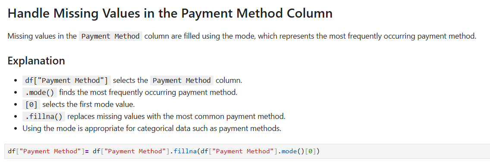

#### Columns Left Unchanged

`Location` and `Transaction Date` were left unchanged because their missing values should not be artificially replaced.

```python
# Location - missing values left unchanged

# Transaction Date - missing values left unchanged
```


### Verify Final Missing Values

After applying the selected strategies, the remaining missing values were checked using:

```python
print(df.isna().sum())
```

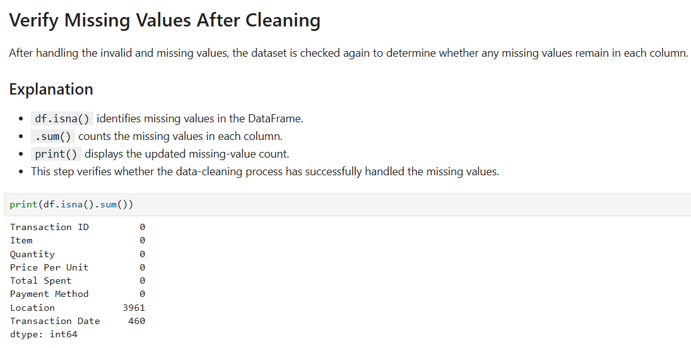

### Rationale

> `UNKNOWN` and `ERROR` values were converted to missing values because they do not represent valid observations. Numerical columns were imputed using the median because it is less affected by extreme values, while categorical columns were imputed using the mode. Columns with a high proportion of missing values or where replacing the value could create misleading information were left unchanged.

|Missing-Value | Strategy | Summary|Column	Strategy |	Rationale|
|Item |	Mode |	Categorical column; | mode provides the most common category|
|Quantity |	Median |	Numerical column; | median is less affected by extreme values|
|Price Per Unit |	Median |	Numerical column; | median provides a robust estimate|
|Total Spent |	Median |	Numerical column; | median is less sensitive to extreme values|
|Payment Method |	Mode	| Categorical column; | mode provides a consistent replacement|
|Location	| Leave unchanged	| Missing location cannot be reliably inferred|
|Transaction Date	| Convert to datetime and leave invalid values missing |	An incorrect date would introduce misleading information|

### Result

The dataset was cleaned by identifying invalid `UNKNOWN` and `ERROR` values, converting them to missing values, and applying an appropriate missing-value strategy to each relevant column. The final dataset is now ready for further analysis.


## Task 3: Fix Incorrect Data Types

Initially, all columns are loaded as `object` because the dataset contains text values such as `ERROR` and `UNKNOWN`.

### Check Initial Data Types

```python
print(df.dtypes)
```

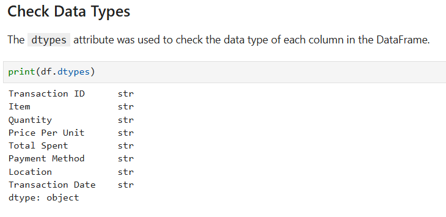

The numerical columns initially appear as `object`.

The following columns need to be converted:

* `Quantity`
* `Price Per Unit`
* `Total Spent`
* `Transaction Date`

### Convert Quantity

```python
df["Quantity"] = pd.to_numeric(
    df["Quantity"],
    errors="coerce"
)
```

### Convert Price Per Unit

```python
df["Price Per Unit"] = pd.to_numeric(
    df["Price Per Unit"],
    errors="coerce"
)
```

### Convert Total Spent

```python
df["Total Spent"] = pd.to_numeric(
    df["Total Spent"],
    errors="coerce"
)
```

### Convert Transaction Date

```python
df["Transaction Date"] = pd.to_datetime(
    df["Transaction Date"],
    errors="coerce"
)
```

### Verify Data Types

```python
print(df.dtypes)
```

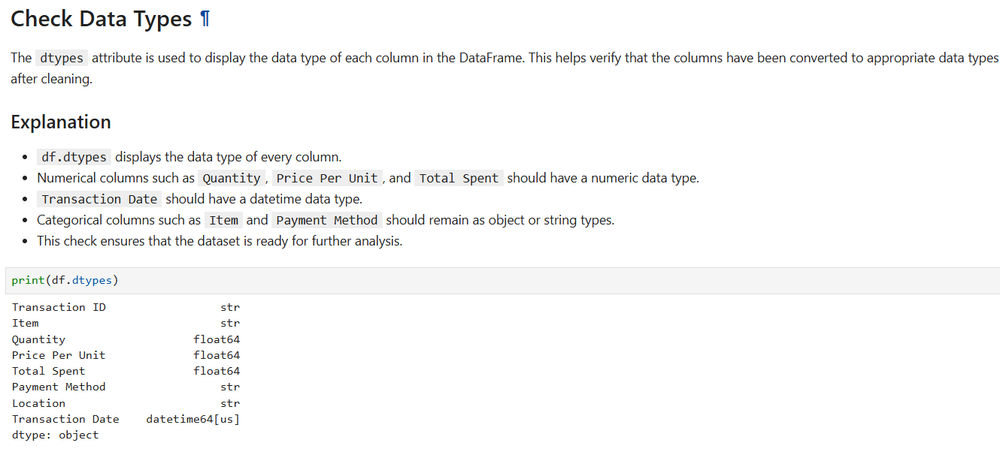

### Rationale

> Numerical columns were converted to numeric types so that mathematical calculations and statistical analysis can be performed correctly, while the transaction date was converted to datetime for accurate date-based analysis.

## Task 4: Find and Handle Duplicates

Duplicate transactions can cause incorrect sales totals and other inaccurate analysis.

### Check Duplicate Rows

```python
print("Duplicate rows:", df.duplicated().sum())
```

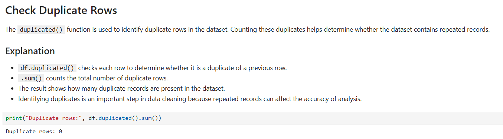

The original dataset contains:

```text
Duplicate rows: 0
```

Therefore, no duplicate records need to be removed.

### Rationale

> No duplicate rows were found, so no records were removed during duplicate handling.

## Outliers

Outliers are unusually high or low numerical values.

The IQR method is used to identify potential outliers.

### Check Quantity Outliers

```python
Q1 = df["Quantity"].quantile(0.25)
Q3 = df["Quantity"].quantile(0.75)

IQR = Q3 - Q1

lower_bound = Q1 - 1.5 * IQR
upper_bound = Q3 + 1.5 * IQR

outliers = df[
    (df["Quantity"] < lower_bound) |
    (df["Quantity"] > upper_bound)
]

print(outliers)
```
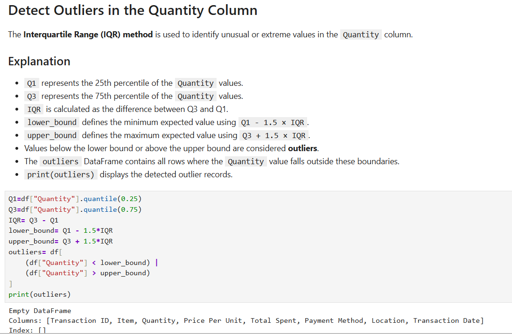

### Check Price Per Unit Outliers

```python
Q1 = df["Price Per Unit"].quantile(0.25)
Q3 = df["Price Per Unit"].quantile(0.75)

IQR = Q3 - Q1

lower_bound = Q1 - 1.5 * IQR
upper_bound = Q3 + 1.5 * IQR

outliers = df[
    (df["Price Per Unit"] < lower_bound) |
    (df["Price Per Unit"] > upper_bound)
]

print(outliers)
```
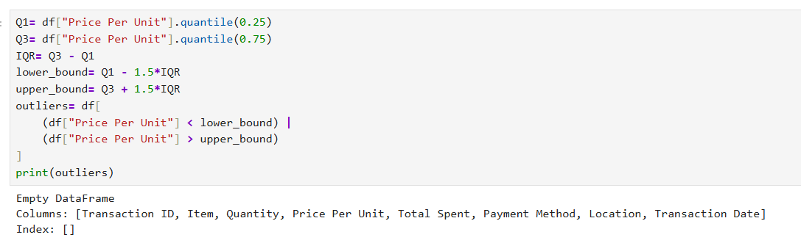

### Check Total Spent Outliers

```python
Q1 = df["Total Spent"].quantile(0.25)
Q3 = df["Total Spent"].quantile(0.75)

IQR = Q3 - Q1

lower_bound = Q1 - 1.5 * IQR
upper_bound = Q3 + 1.5 * IQR

outliers = df[
    (df["Total Spent"] < lower_bound) |
    (df["Total Spent"] > upper_bound)
]

print(outliers)
```
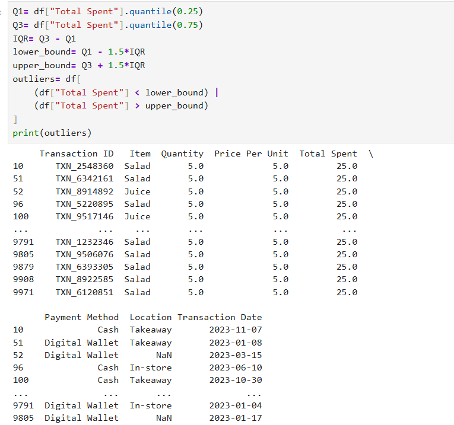

### Outlier Evaluation

The numerical values in this dataset fall within relatively small and realistic ranges:

* `Quantity`: 1 to 5
* `Price Per Unit`: 1.0 to 5.0
* `Total Spent`: 1.0 to 25.0

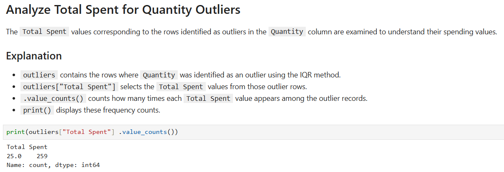

Potential IQR outliers should therefore be inspected rather than automatically deleted.

### Rationale

> Potential outliers were checked using the IQR method and retained when they represented plausible cafe transactions rather than obvious data-entry errors.

## Task 5: Confirm the Cleaned Data

After applying the cleaning operations, the final DataFrame is checked to ensure that the data is consistent.

### Check Missing Values

```python
print("Missing values:")
print(df.isnull().sum())
```


The remaining missing values should be reviewed carefully, particularly in `Transaction Date`, because invalid dates cannot be reliably reconstructed.

### Check Invalid Values

```python
for column in df.columns:
    print(column, df[column].isin(["UNKNOWN", "ERROR"]).sum())
```

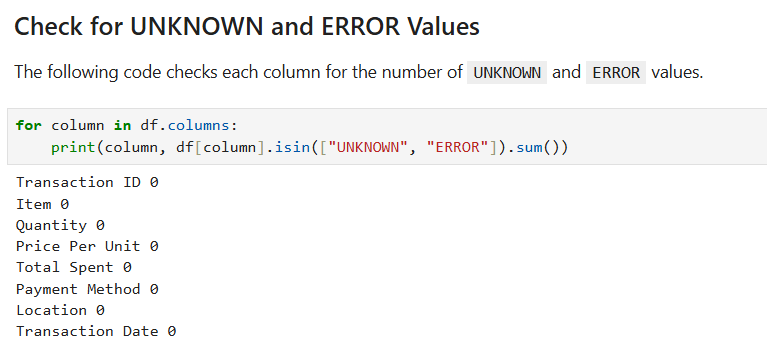

There should be no remaining `UNKNOWN` or `ERROR` values.

### Check Duplicate Rows

```python
print("Duplicate rows:", df.duplicated().sum())
```


The dataset contains no duplicate rows.

### Check Data Types

```python
print(df.dtypes)
```

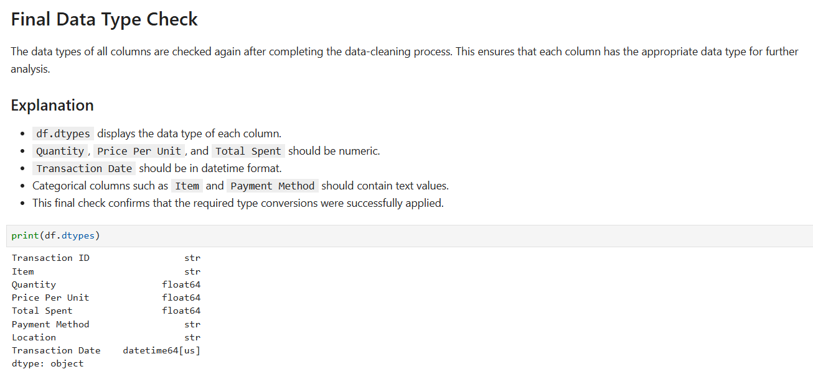

The numerical columns should now have numeric data types and `Transaction Date` should have a datetime type.

### Check Numerical Ranges

```python
print(df.describe())
```

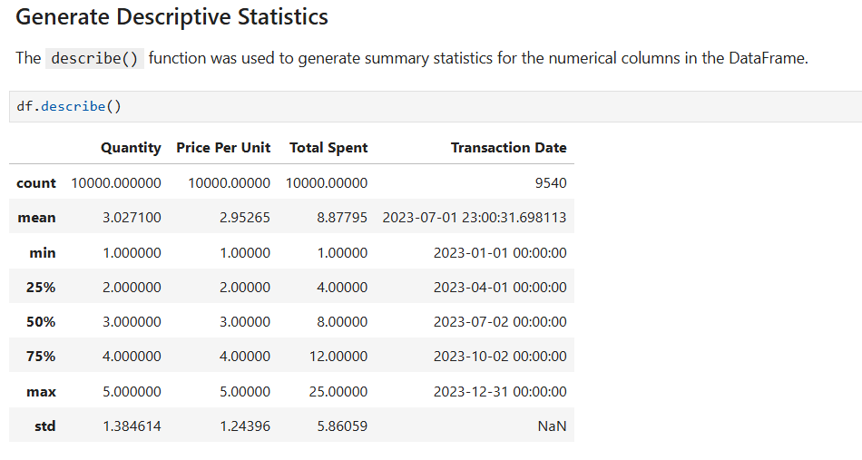

The statistical summary is used to verify that the numerical columns contain sensible values.

### Check Final Shape

```python
print("Final shape:", df.shape)
```

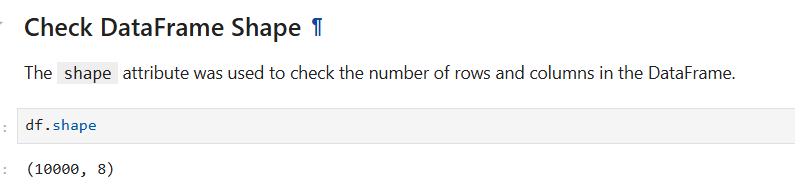

The original dataset contains:

```text
10000 rows
8 columns
```

The final number of rows should remain unchanged if no rows are dropped during cleaning.

## Cleaning Decisions Summary

| Column             | Problem                                     | Action                               | Rationale                                                    |
| ------------------ | ------------------------------------------- | ------------------------------------ | ------------------------------------------------------------ |
| `Transaction ID`   | No missing values                           | Leave                                | Unique transaction identifier is already complete            |
| `Item`             | Missing, `UNKNOWN`, `ERROR`                 | Replace with mode                    | Categorical column; mode provides the most common category   |
| `Quantity`         | Missing, `UNKNOWN`, `ERROR`, stored as text | Convert to numeric and impute median | Numerical column; median is robust to extreme values         |
| `Price Per Unit`   | Missing, `UNKNOWN`, `ERROR`, stored as text | Convert to numeric and impute median | Numerical column; median provides a robust estimate          |
| `Total Spent`      | Missing and `ERROR`, stored as text         | Convert to numeric and impute median | Numerical column; median is less sensitive to unusual values |
| `Payment Method`   | High missingness, `UNKNOWN`, `ERROR`        | Fill with mode                       | Categorical column; mode provides a consistent category      |
| `Location`         | High missingness, `UNKNOWN`, `ERROR`        | Label as `Unknown`                   | Over 30% is missing, so mode imputation could introduce bias |
| `Transaction Date` | Missing, `UNKNOWN`, `ERROR`, stored as text | Convert to datetime                  | Dates must be stored as datetime for correct date analysis   |

## Initial Dataset Problems

The original dataset contains several data-quality issues.

### Missing Values

The highest missingness is found in:

* `Location`: **3265 values (32.65%)**
* `Payment Method`: **2579 values (25.79%)**
* `Item`: **333 values (3.33%)**
* `Price Per Unit`: **179 values (1.79%)**
* `Total Spent`: **173 values (1.73%)**
* `Transaction Date`: **159 values (1.59%)**
* `Quantity`: **138 values (1.38%)**

### Invalid Values

The dataset also contains:

* `UNKNOWN`
* `ERROR`

These values occur in several categorical and numerical columns and must be converted to missing values before cleaning.

### Incorrect Data Types

The numerical columns are initially stored as `object` because they contain text values such as `ERROR` and `UNKNOWN`.

These columns need to be converted to numeric types before analysis.

## Final Validation

The following checks are performed after cleaning:

```python
print("Missing values:")
print(df.isnull().sum())

print("\nDuplicate rows:")
print(df.duplicated().sum())

print("\nData types:")
print(df.dtypes)

print("\nDataset shape:")
print(df.shape)

print("\nStatistical summary:")
print(df.describe())
```

These checks confirm that:

* Invalid `UNKNOWN` and `ERROR` values have been handled
* Numerical columns have appropriate numeric data types
* The transaction date has been converted to datetime
* Duplicate records have been checked
* Numerical values fall within sensible ranges
* The cleaned DataFrame is ready for further analysis

## Conclusion

This lab demonstrates how to clean a messy cafe sales dataset using Pandas.

The dataset initially contained missing values, `UNKNOWN` values, `ERROR` values, incorrect numerical data types, and invalid date entries. Each problem was identified and handled using an appropriate strategy rather than applying the same cleaning method to every column.

Categorical missing values were handled using the mode where appropriate, while the heavily missing `Location` column was assigned an explicit `Unknown` category to avoid introducing bias. Numerical columns were converted to numeric types and their missing values were handled using the median. The transaction date was converted to datetime, and invalid dates were treated as missing.

Duplicate records were checked and none were found. Potential outliers were evaluated using the IQR method and retained when they represented plausible cafe transactions.

