# Lab 4: Statistics Intuition

## Overview

This lab focuses on understanding and interpreting statistical measures instead of simply calculating them. The analysis is performed on the `SuperMarket Analysis.csv` dataset, which contains 1,000 supermarket sales transactions.

The dataset includes information such as branch, city, customer type, gender, product line, unit price, quantity, sales, payment method, gross income, and customer rating.

The main goal of this lab is to understand distributions, relationships between numerical variables, and uncertainty in statistical comparisons.

---

## Objective

The objective of this lab is to develop an understanding of basic statistical concepts by analyzing supermarket sales data. The lab focuses on calculating and interpreting descriptive statistics, understanding data distributions, identifying skewness and outliers, analyzing relationships between numerical variables using correlation, and comparing two groups using hypothesis testing.

- Calculate and interpret mean, median, and standard deviation.
- Calculate and interpret different percentiles.
- Understand the difference between mean and median.
- Visualize data using histograms and boxplots.
- Identify skewness and potential outliers.
- Calculate and interpret correlations between numerical variables.
- Understand why correlation does not imply causation.
- Formulate null and alternative hypotheses.
- Perform an independent two-sample t-test.
- Interpret p-values and statistical significance.

---

## Technologies and Libraries Used

- **Python** – Used for statistical analysis and data processing.
- **Pandas** – Used for loading, cleaning, and analyzing the dataset.
- **NumPy** – Used for numerical operations.
- **Matplotlib** – Used for creating visualizations.
- **Seaborn** – Used for statistical visualizations such as histograms, boxplots, and heatmaps.
- **SciPy** – Used for performing the independent two-sample t-test.

---

## Dataset

**Dataset:** `SuperMarket Analysis.csv`

The dataset contains **1,000 rows and 17 columns**.

Important columns used in this lab include:

* `Sales` – total sales amount for a transaction
* `Quantity` – number of products purchased
* `Unit price` – price per unit
* `gross income` – gross income generated from the transaction
* `Gender` – gender of the customer
* `Payment` – payment method used
* `Rating` – customer rating

---

# Task 1: Descriptive Statistics


The first task is to calculate descriptive statistics for the numerical column `Sales`.


The following statistical measures are calculated:


- Mean
- Median
- Standard deviation
- 25th percentile
- 50th percentile
- 75th percentile
- 90th percentile
- 95th percentile

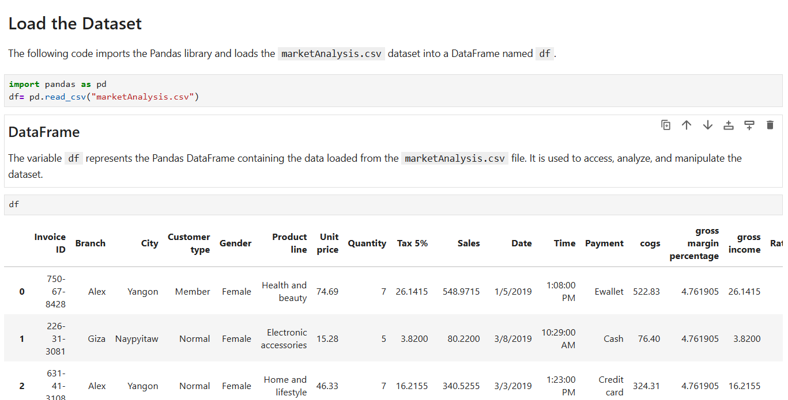

## Select the Numerical Column


The `Sales` column is selected for statistical analysis.


```python
sales = df["Sales"]
```
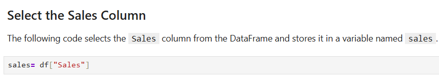

## Mean

The mean represents the average value of the Sales column.

```python
mean = sales.mean()
print("Mean: ", mean)
```
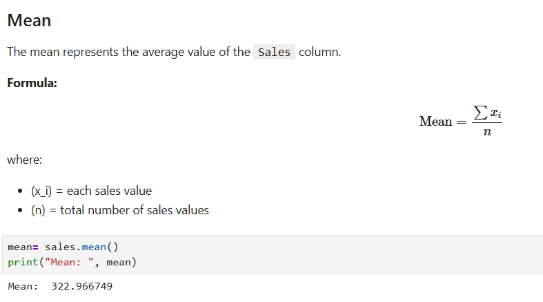

## Median

The median represents the middle value of the Sales column when all values are arranged in ascending order.

```python
median = sales.median()
print("Median: ", median)
```
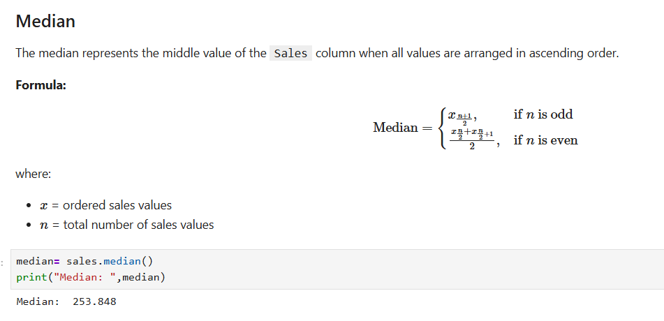

## Standard Deviation

Standard deviation measures how much the Sales values vary or spread out from the mean.

```python
std = sales.std()
print("Standard Deviation: ", std)
```
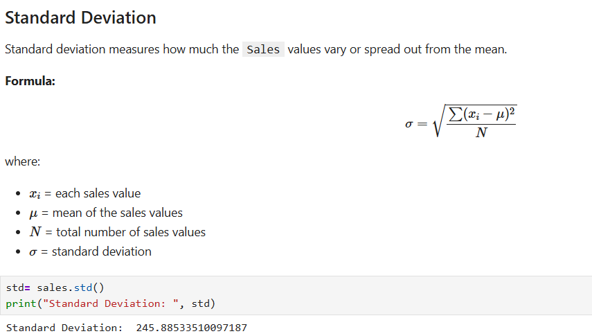

A higher standard deviation indicates greater variation in sales values, while a lower standard deviation indicates that the values are closer to the mean.

## Percentiles

Percentiles indicate the value below which a certain percentage of observations fall.

The following percentiles are calculated:

25th percentile (Q1): 25% of the sales values are below this value.
50th percentile (Q2): 50% of the sales values are below this value. This is also the median.
75th percentile (Q3): 75% of the sales values are below this value.
90th percentile: 90% of the sales values are below this value.
95th percentile: 95% of the sales values are below this value.

```python
percentiles = sales.quantile([0.25, 0.50, 0.75, 0.90, 0.95])
print("Percentiles: \n", percentiles)
```
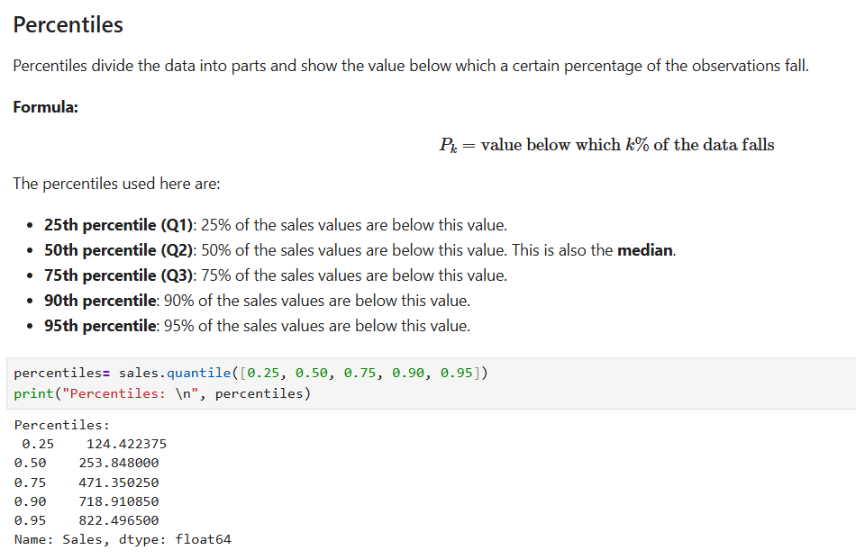

## Interpretation

The calculated statistics help us understand the distribution and variability of sales.

For this dataset:

- Mean = 322.97
- Median = 253.85
- Standard Deviation = 245.89

Since the mean is noticeably greater than the median, the Sales distribution appears to be right-skewed (positively skewed). This suggests that some transactions have relatively high sales values, which pull the mean upward.

The standard deviation of 245.89 indicates considerable variation in sales values around the mean.

The percentiles provide additional information about how sales are distributed. For example, the 25th percentile represents the value below which approximately 25% of the observations fall, while the 75th percentile represents the value below which approximately 75% of the observations fall.

Overall, these measures provide an understanding of the center, spread, and distribution of the Sales data.

---
# Task 2: Distribution, Skewness and Outliers

## Objective

The objective of this task is to understand the **distribution of Sales**, identify its **skewness**, and detect possible **outliers** using visualizations and statistical methods.

## 1. Visualizing the Distribution

A histogram is used to visualize the distribution of the `Sales` column.

```python
import matplotlib.pyplot as plt

sns.histplot(df["Sales"], bins=30, edgecolor="black")

plt.title("Distribution of Sales")
plt.xlabel("Sales")
plt.ylabel("Frequency")
plt.show()
```
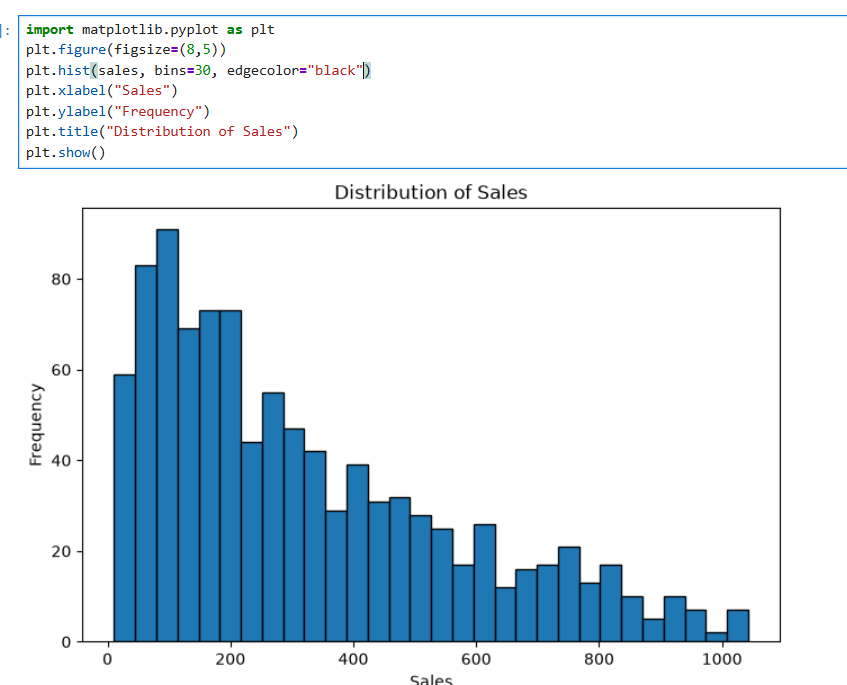

The histogram shows how frequently different sales values occur and helps in understanding the overall shape of the distribution.

## 2. Identifying Skewness

Skewness describes the **asymmetry of a distribution**.

```python
skewness = df["Sales"].skew()
print("Skewness:", skewness)
```
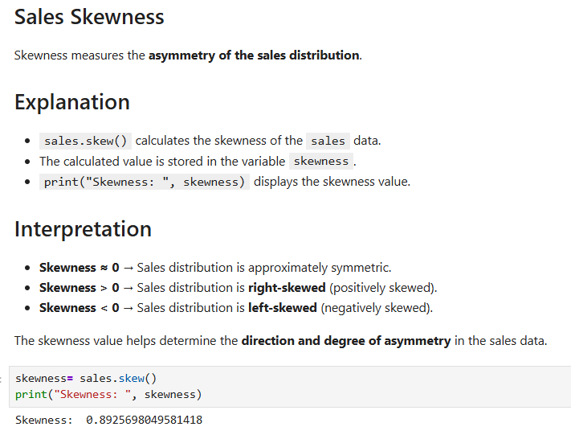

### Interpretation

* **Skewness ≈ 0** → Distribution is approximately symmetric.
* **Skewness > 0** → Distribution is **right-skewed (positively skewed)**.
* **Skewness < 0** → Distribution is **left-skewed (negatively skewed)**.

The skewness value helps determine the direction and degree of asymmetry in the sales data.

## 3. Detecting Outliers Using a Boxplot

A boxplot is used to identify unusually high or low sales values.

```python
sns.boxplot(x=df["Sales"])

plt.title("Boxplot of Sales")
plt.xlabel("Sales")
plt.show()
```

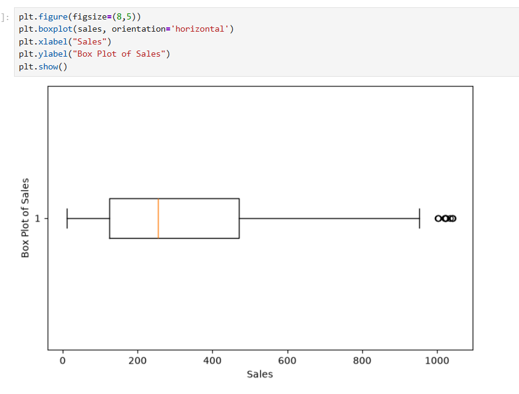

The boxplot displays the median, quartiles, spread of the data, and potential outliers.

## 4. Detecting Outliers Using IQR

The Interquartile Range (IQR) method can be used to identify potential outliers mathematically.

```python
Q1 = df["Sales"].quantile(0.25)
Q3 = df["Sales"].quantile(0.75)

IQR = Q3 - Q1

lower_bound = Q1 - 1.5 * IQR
upper_bound = Q3 + 1.5 * IQR

outliers = df[
    (df["Sales"] < lower_bound) |
    (df["Sales"] > upper_bound)
]

print("Q1:", Q1)
print("Q3:", Q3)
print("IQR:", IQR)
print("Lower Bound:", lower_bound)
print("Upper Bound:", upper_bound)
print("Number of Outliers:", len(outliers))
```
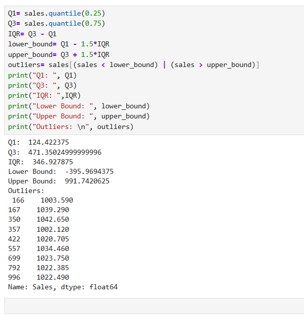


Values below the lower bound or above the upper bound are considered **potential outliers**.

## Interpretation

The histogram helps understand the overall **shape and distribution** of sales and indicates whether the data is symmetric or skewed.

The boxplot helps identify the **median, spread, and potential outliers** in the sales data.

Outliers should **not automatically be removed**. They may represent genuine high-value transactions or unusual but valid observations. They should be investigated before deciding whether to remove or modify them.

---

# Task 3: Correlation Analysis

Correlation is used to measure the **strength and direction of the relationship** between numerical variables.

The correlation matrix is calculated using the numerical columns.

```python
corr = df.corr(numeric_only=True)

print(corr)
```
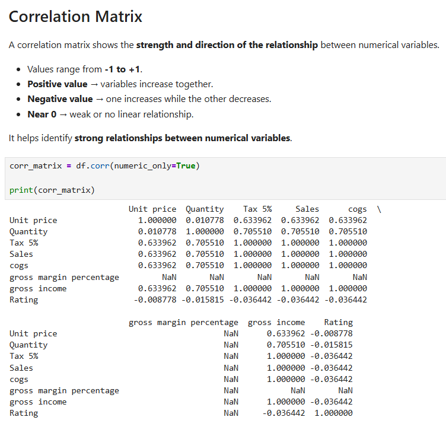


The correlation matrix is then converted into correlation pairs.

```python
corr_pairs = corr.unstack()
print(corr_pairs)
```
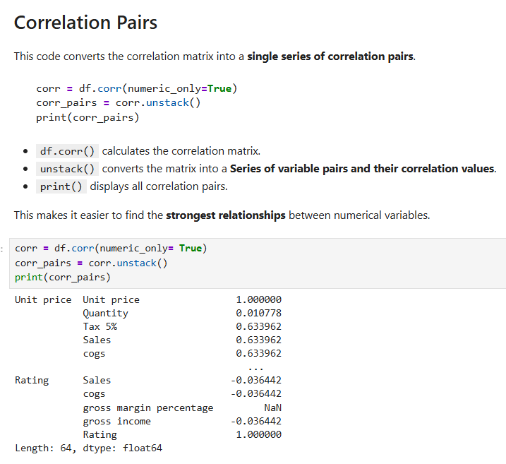


Self-correlations are removed because every variable has a correlation of `1` with itself.

```python
corr_pairs = corr_pairs[
    corr_pairs.index.get_level_values(0) !=
    corr_pairs.index.get_level_values(1)
]

print(corr_pairs)
```
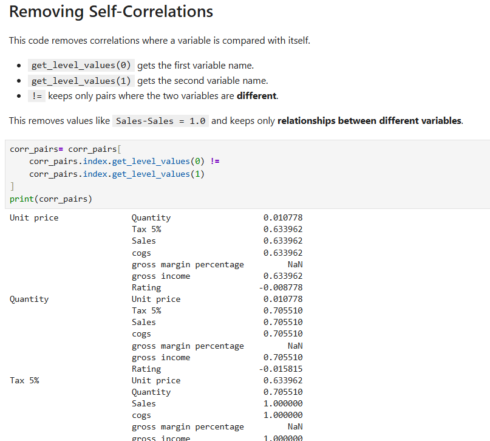

The strongest correlation pair is identified using the absolute correlation values.

```python
strongest_pair = corr_pairs.abs().sort_values(ascending=False).index[0]

print(strongest_pair)
print("Correlation:", corr.loc[strongest_pair[0], strongest_pair[1]])
```
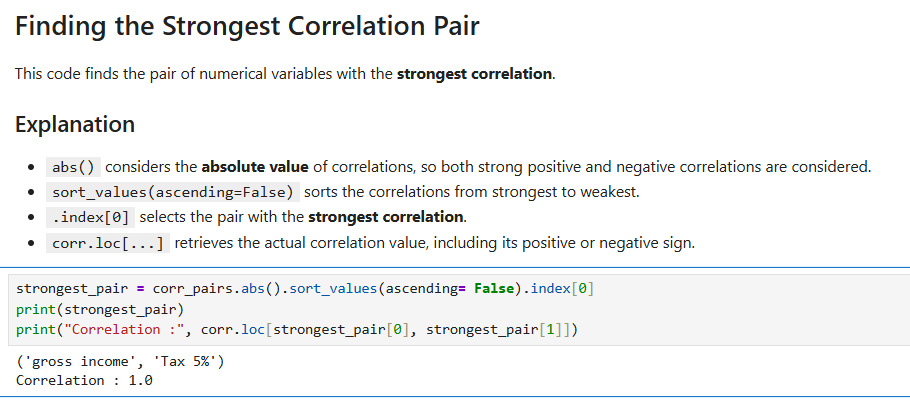

### Interpretation

The correlation coefficient ranges from **-1 to +1**.

* A value close to **+1** indicates a strong positive relationship.
* A value close to **-1** indicates a strong negative relationship.
* A value close to **0** indicates a weak or no linear relationship.

The strongest pair represents the two numerical variables with the highest absolute correlation.

A strong correlation means that two variables tend to change together. However, **correlation does not prove causation**.

For example, if `Quantity` and `Sales` have a strong positive correlation, it means that transactions with higher quantities tend to have higher sales. It does not prove that quantity alone causes the increase in sales because other factors, such as **Unit Price** and **Product Type**, can also affect sales.


# Task 4: Hypothesis Testing

The final task compares the **average sales of two customer groups** based on `Gender`.

The two groups are:

* Male customers
* Female customers

An **independent two-sample t-test** is used to determine whether there is a statistically significant difference between the average sales of the two groups.

### Hypotheses

**Null Hypothesis (H₀):**

There is **no significant difference** in the average sales between male and female customers.

**Alternative Hypothesis (H₁):**

There is a **significant difference** in the average sales between male and female customers.

```python
from scipy.stats import ttest_ind

male_sales = df[df["Gender"] == "Male"]["Sales"].dropna()
female_sales = df[df["Gender"] == "Female"]["Sales"].dropna()

t_stat, p_value = ttest_ind(
    male_sales,
    female_sales,
    equal_var=False
)

print("T-statistic:", t_stat)
print("P-value:", p_value)
```
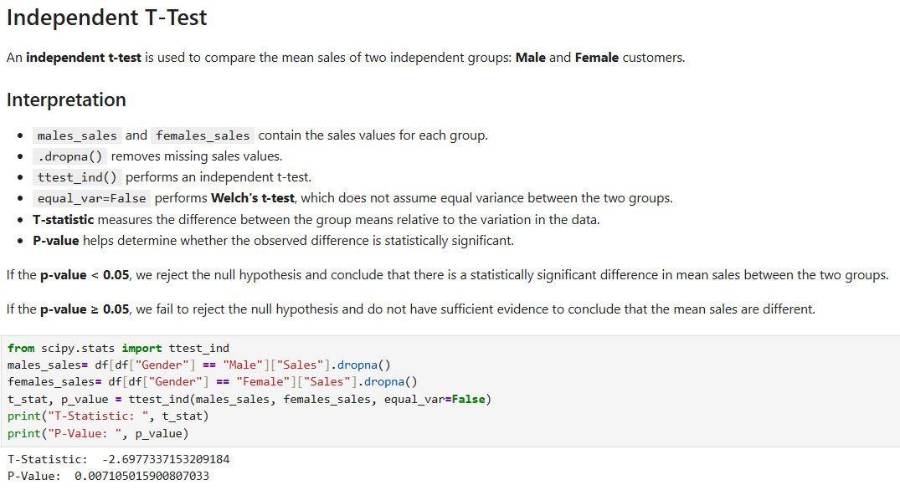

### P-value Interpretation

A significance level of **0.05** is used.

```python
if p_value < 0.05:
    print("Reject the null hypothesis.")
else:
    print("Do not reject the null hypothesis.")
```
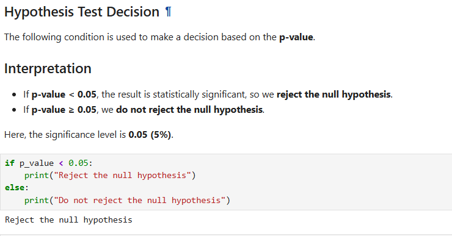

If the **p-value is less than 0.05**, we reject the null hypothesis and conclude that there is **sufficient statistical evidence of a difference in average sales** between male and female customers.

If the **p-value is greater than or equal to 0.05**, we do not reject the null hypothesis because there is **not enough statistical evidence** to conclude that the average sales are different.

### What a P-value Does and Does Not Tell Us

A p-value tells us how consistent the observed data is with the null hypothesis. A small p-value provides stronger evidence against the null hypothesis.

A p-value **does not** tell us:

* The probability that the null hypothesis is true.
* The size or practical importance of the difference.
* That one variable causes the other.

It only helps us determine whether the observed difference is **statistically significant** under the assumptions of the test.

---

# Conclusion

This lab demonstrates how statistical techniques can be used to understand real-world supermarket sales data.

The analysis covers:

1. Descriptive statistics using mean, median, standard deviation, and percentiles.
2. Distribution analysis using histograms and boxplots.
3. Correlation analysis to identify relationships between numerical variables.
4. Hypothesis testing using an independent t-test.

The main takeaway is that statistical results should not be interpreted only as numbers. Mean, median, distributions, correlations, and p-values all provide different types of information, and each must be interpreted in the correct context.

Statistics can help identify patterns and differences in data, but they do not automatically establish causation.
