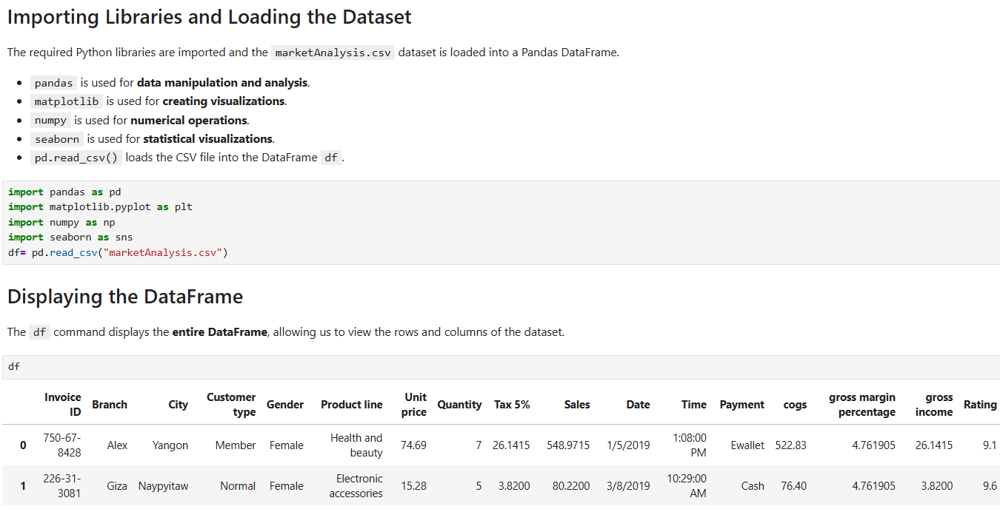
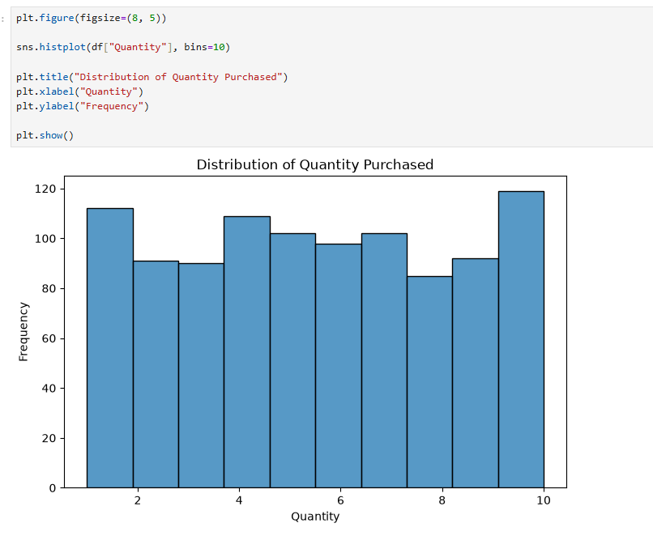
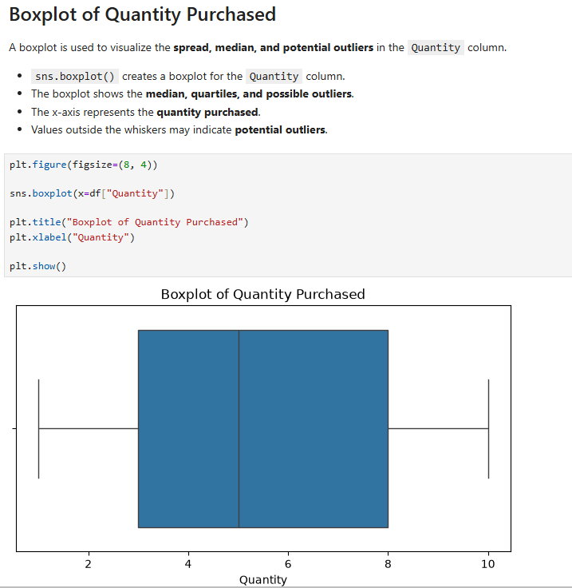
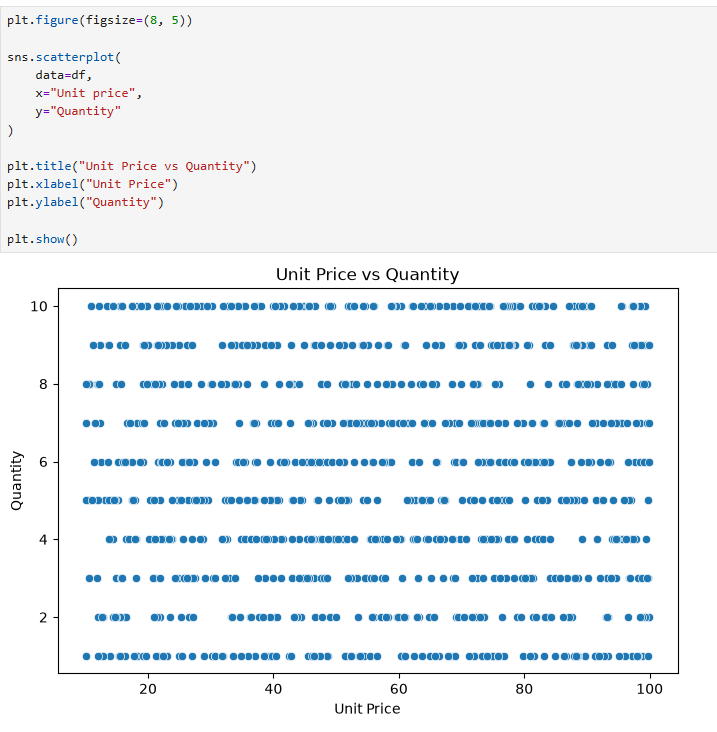
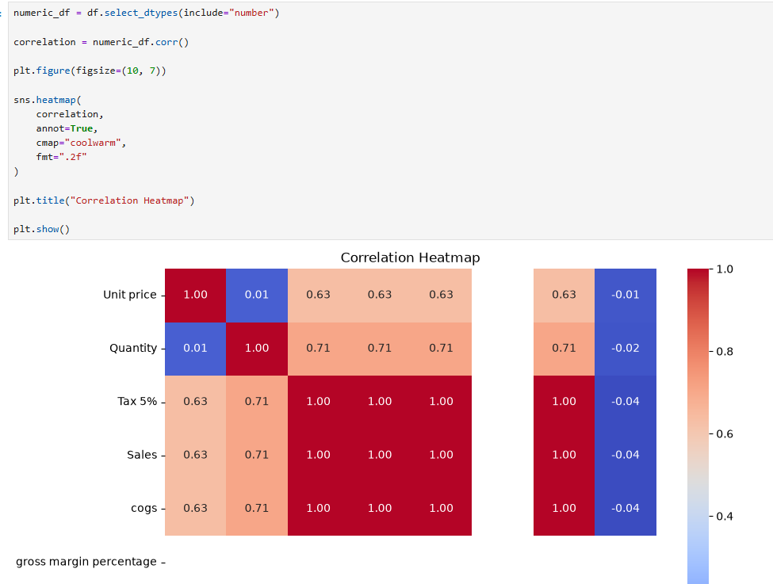

# Lab 5: Visualization and Mini-EDA

## Overview

This lab focuses on using data visualization techniques to explore and communicate patterns in a dataset. The analysis is performed on the `SuperMarket Analysis.csv` dataset, which contains 1,000 supermarket sales transactions.

Instead of focusing on the `Sales` column, this lab uses **`Quantity`** as the primary numerical variable. Different visualizations are created to understand the distribution of quantities purchased, relationships between variables, and correlations among numerical features.

The main goal is to reveal and communicate structure in the dataset through clear, labeled, and meaningful charts.

---

## Objective

The objective of this lab is to understand how data visualization can be used to explore a dataset and communicate meaningful patterns.


* Create a labeled histogram to understand the distribution of `Quantity`.
* Create a boxplot to identify the spread and potential outliers in `Quantity`.
* Create a scatter plot to examine the relationship between `Unit price` and `Quantity`.
* Create a correlation heatmap using numerical variables.
* Perform a quick Exploratory Data Analysis (EDA).
* Identify meaningful patterns from visualizations.
* Communicate observations using simple and concise statements.

---

## Dataset

**Dataset:** `SuperMarket Analysis.csv`

The dataset contains **1,000 rows and 17 columns** representing supermarket transactions.

Important columns used in this lab include:

* `Quantity` – Number of products purchased in a transaction.
* `Unit price` – Price of one product unit.
* `Tax 5%` – Tax amount charged on the transaction.
* `gross income` – Gross income generated from the transaction.
* `Rating` – Customer rating.
* `Gender` – Gender of the customer.
* `Payment` – Payment method used.

---

## Technologies and Libraries Used

* **Python** – Used for data analysis and visualization.
* **Pandas** – Used for loading and handling the dataset.
* **NumPy** – Used for numerical operations.
* **Matplotlib** – Used for creating and customizing visualizations.
* **Seaborn** – Used for statistical visualizations.

### Libraries

```python
import pandas as pd
import numpy as np
import matplotlib.pyplot as plt
import seaborn as sns
```

---

# Task 1: Histogram and Boxplot

The first task focuses on understanding the distribution of the `Quantity` variable.

### Histogram

A histogram is used to show how frequently different quantities are purchased.

```python
plt.figure(figsize=(8, 5))

sns.histplot(df["Quantity"], bins=10, kde=True)

plt.title("Distribution of Quantity Purchased")
plt.xlabel("Quantity")
plt.ylabel("Frequency")

plt.show()
```


### Boxplot

A boxplot is used to understand the spread of `Quantity` and identify potential outliers.

```python
plt.figure(figsize=(8, 4))

sns.boxplot(x=df["Quantity"])

plt.title("Boxplot of Quantity Purchased")
plt.xlabel("Quantity")

plt.show()
```


### Interpretation

The distribution of Quantity shows that purchases range from 1 to 10 products per transaction, with quantities spread across this range.

The boxplot shows the median, spread, and potential unusual values. Any values appearing far away from the main distribution may be considered potential outliers.

---

# Task 2: Scatter Plot

A scatter plot is created to examine the relationship between `Unit price` and `Quantity`.

```python
plt.figure(figsize=(8, 5))

sns.scatterplot(
    data=df,
    x="Unit price",
    y="Quantity"
)

plt.title("Unit Price vs Quantity")
plt.xlabel("Unit Price")
plt.ylabel("Quantity")

plt.show()
```


### Observation

The scatter plot shows that quantity is spread across different unit prices, with **no strong visible linear relationship** between unit price and quantity purchased.

---

# Task 3: Correlation Heatmap

A correlation heatmap is used to visualize relationships between numerical variables.

```python
numeric_df = df.select_dtypes(include="number")

correlation = numeric_df.corr()

plt.figure(figsize=(10, 7))

sns.heatmap(
    correlation,
    annot=True,
    cmap="coolwarm",
    fmt=".2f"
)

plt.title("Correlation Heatmap")

plt.show()
```


### Interpretation

The correlation coefficient ranges from **-1 to +1**.

* A value close to **+1** indicates a strong positive relationship.
* A value close to **-1** indicates a strong negative relationship.
* A value close to **0** indicates a weak or no linear relationship.

The heatmap helps identify which numerical variables have stronger or weaker relationships with each other.

---

# Task 4: Quick Mini-EDA

The final task is to perform a quick Exploratory Data Analysis using the visualizations created in the previous tasks.

Three concise observations are written based on the actual charts.

### Observation 1

> The distribution of Quantity shows that purchases are spread across quantities from 1 to 10, with no single quantity dominating the dataset.

### Observation 2

> The scatter plot shows that Quantity varies across different Unit Prices, with no strong visible linear relationship between the two variables.

### Observation 3

> The correlation heatmap shows strong positive relationships between Sales, Tax, cogs, and gross income, while Quantity and Unit Price have a much weaker linear relationship.

---

# Conclusion

This lab demonstrates how visualization techniques can be used to explore and communicate patterns in supermarket transaction data.

The analysis includes:

1. A histogram to understand the distribution of `Quantity`.
2. A boxplot to identify the spread and potential outliers in `Quantity`.
3. A scatter plot to examine the relationship between `Unit price` and `Quantity`.
4. A correlation heatmap to visualize relationships between numerical variables.
5. A mini-EDA consisting of three concise observations.

The main takeaway is that effective data visualization helps reveal patterns that may not be immediately visible from raw data. Charts should not only be created but also interpreted to communicate meaningful insights from the dataset.
