# Car Price Prediction Using Linear Regression

## Project Overview

This project focuses on predicting the price of used cars using **Linear Regression**.

The dataset contains information about different cars, including their year, mileage, tax, fuel type, transmission, manufacturer, engine size, model, and other attributes.

The project follows a complete machine learning workflow, starting from **data cleaning and exploratory data analysis (EDA)** and progressing to **feature selection, categorical encoding, model training, validation, evaluation, model comparison, and model serialization using Pickle**.

---

## Objectives

- Understand and analyze the car dataset.
- Perform data cleaning and preprocessing.
- Explore relationships between car features and price using EDA.
- Select meaningful features for prediction.
- Convert categorical variables into numerical form.
- Train Linear Regression models.
- Evaluate model performance using **MSE, RMSE, and R²**.
- Calculate **SST, SSE, and SSR**.
- Check for overfitting by comparing training and testing performance.
- Use a **Train / Validation / Test** approach for model evaluation.
- Compare different feature combinations.
- Save and load the trained model using Pickle.

---

## Dataset

The dataset initially contains **72,435 records and 10 columns**.

### Features

| Feature | Description |
|---|---|
| `year` | Manufacturing year of the car |
| `mileage` | Mileage of the car |
| `tax` | Tax associated with the car |
| `mpg` | Miles per gallon |
| `engineSize` | Engine size |
| `model` | Car model |
| `transmission` | Type of transmission |
| `fuelType` | Type of fuel |
| `Make` | Car manufacturer |
| `price` | Target variable representing car price |

---

## Data Cleaning

The following preprocessing steps were performed:

- Checked the dataset structure and data types.
- Checked for missing values.
- Checked for duplicate records.
- Found **842 duplicate records**.
- Removed duplicate records.
- Final dataset contained approximately **71,593 records**.
- Verified that there were no missing values.

---

# Exploratory Data Analysis

EDA was performed before model training to understand the dataset and identify potentially useful features.

### 1. Numerical Feature Distributions

Histograms were used to understand the distribution of numerical variables such as:

- Year
- Mileage
- Tax
- MPG
- Engine Size
- Price

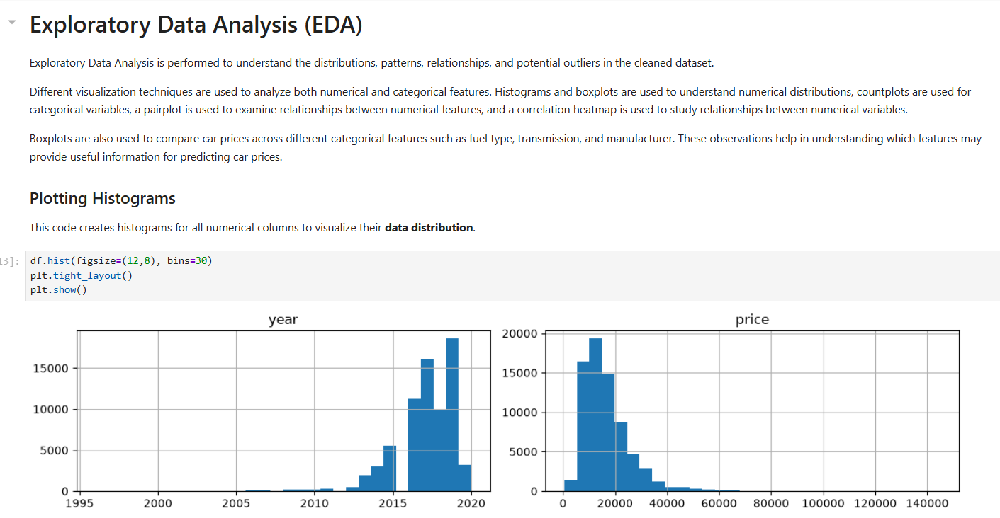

### 2. Boxplots

Boxplots were used to understand the spread of numerical variables and investigate potential outliers.
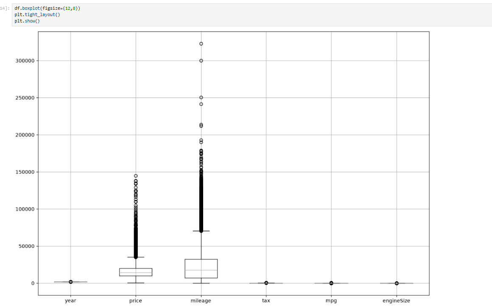

### 3. Categorical Feature Analysis

Countplots were used to understand the distribution of:

- Transmission
- Fuel Type
- Make
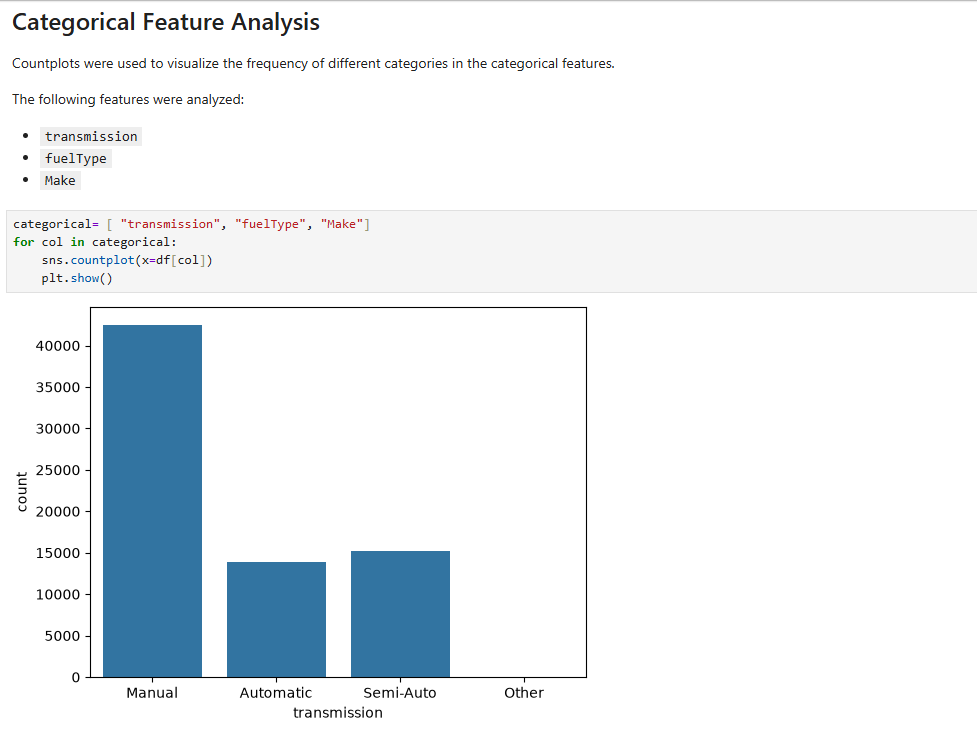

### 4. Pairplot

A pairplot was used to visualize relationships between numerical variables and identify possible relationships with the target variable `price`.
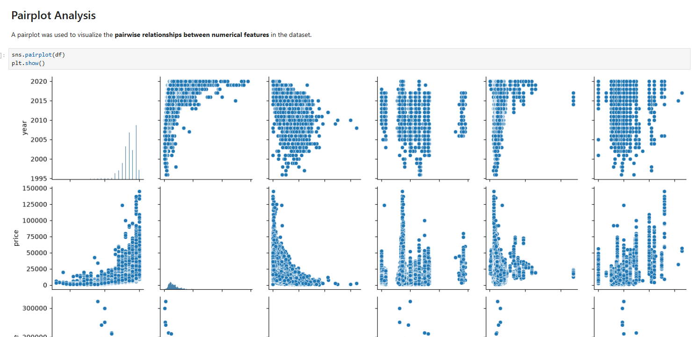

### 5. Correlation Heatmap

A correlation heatmap was created to understand relationships between numerical features and `price`.
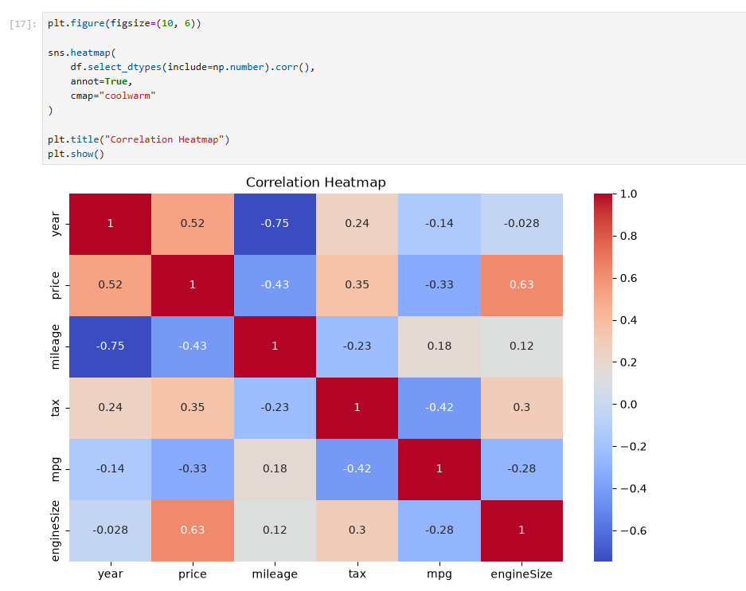

### 6. Price vs Categorical Features

Boxplots were created to compare car prices across:

- Fuel Type
- Transmission
- Make

These visualizations showed differences in price distributions across categories.
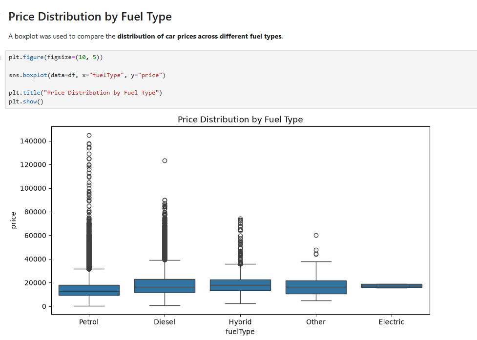

---

# EDA-Based Feature Selection

EDA was used to guide feature selection instead of selecting variables randomly.

### Numerical Features

The following numerical features were selected:

```text
year
mileage
tax
mpg
engineSize
```

### Categorical Features

The following categorical features were selected:

```text
transmission
fuelType
Make
model
```

The `model` feature was included in the final model because different car models can have substantially different price ranges.

Categorical variables were converted into numerical variables using **One-Hot Encoding**.

---

# Model 1 — Numerical Features Only

The first Linear Regression model used only numerical features:

```python
X = df[
    [
        "year",
        "mileage",
        "tax",
        "mpg",
        "engineSize"
    ]
]

y = df["price"]

```
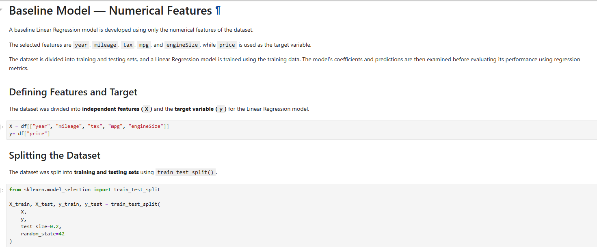

### Performance

| Metric | Result |
|---|---:|
| **R²**       | **0.7238**        |
| **RMSE**     | **4924.96**       |
| **MSE**      | **24,255,227.07** |

The model explained approximately **72.38% of the variation in car prices**.
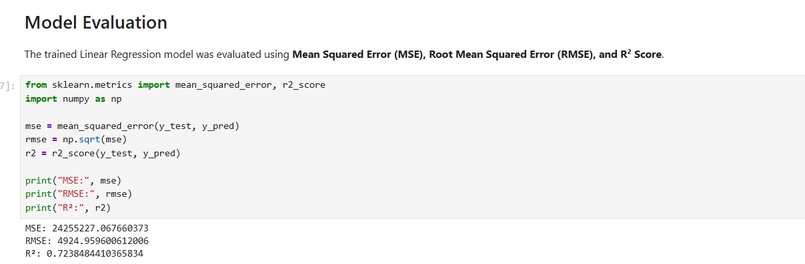

---

# Model 2 — Numerical and Categorical Features

The final model includes both numerical and categorical features, including the `model` feature.

### Features Used

```python
numerical_features = [
    "year",
    "mileage",
    "tax",
    "mpg",
    "engineSize"
]

categorical_features = [
    "transmission",
    "fuelType",
    "Make",
    "model"
]
```
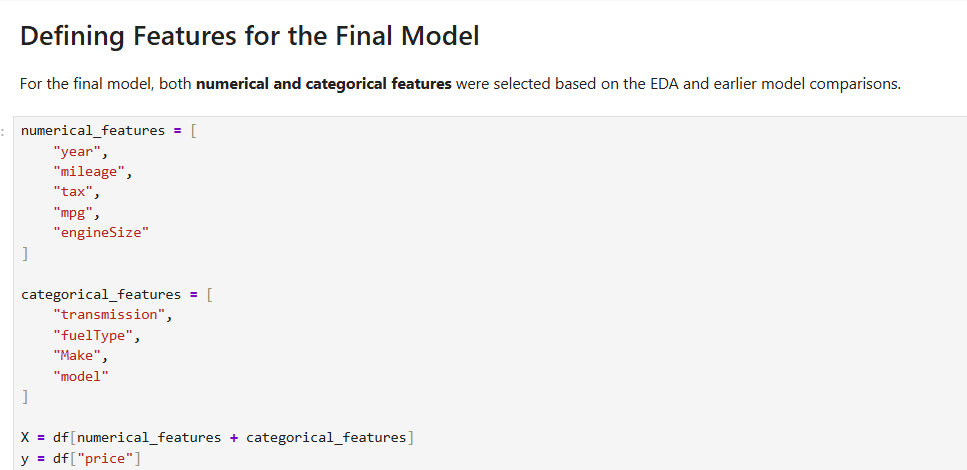


## Train / Validation / Test Split

Instead of using cross-validation, the final model uses three separate datasets:

- **Training Set** — used to train the model. 
- **Validation Set** — used to evaluate the model during development. 
- **Test Set** — used for the final evaluation. 

The dataset was divided approximately as:

```text
64% → Training
16% → Validation
20% → Testing
```
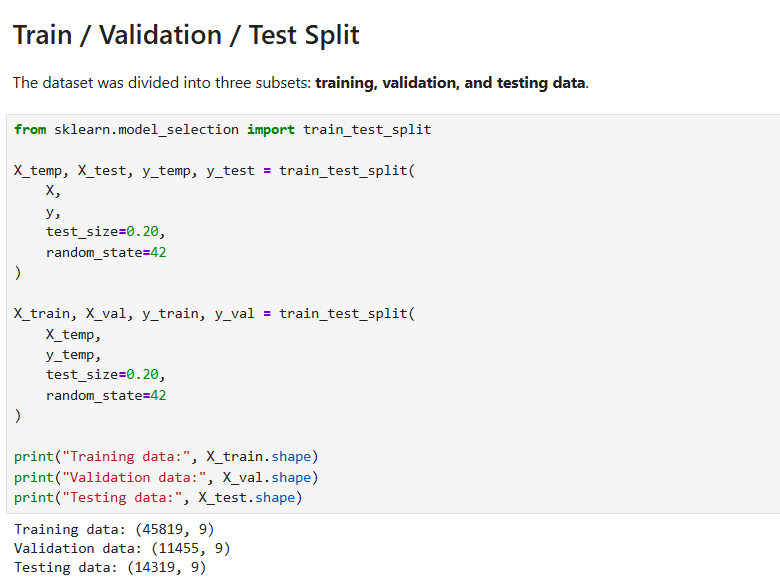

---

## Categorical Encoding

Categorical variables were converted into numerical features using **OneHotEncoder**.

```python
OneHotEncoder(handle_unknown="ignore")
```

The `handle_unknown="ignore"` option allows the model to handle categories that may appear in validation or test data but were not present during training.
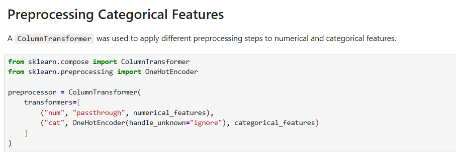

---

## Machine Learning Pipeline

A Scikit-learn Pipeline was used to combine preprocessing and model training:

```python
pipeline = Pipeline([
    ("preprocessing", preprocessor),
    ("model", LinearRegression())
])
```

This keeps the preprocessing and model together and ensures that the same transformations are applied during prediction.
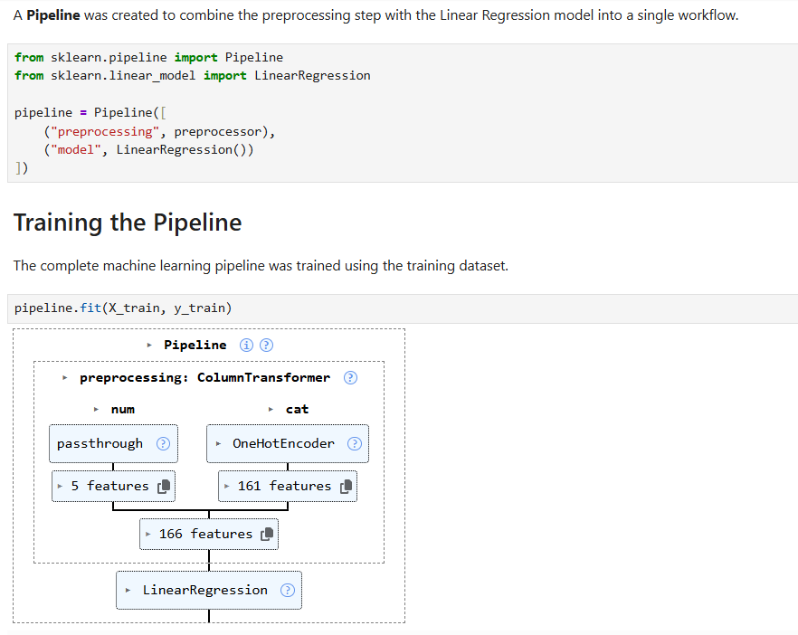

---

## Final Model Performance

### Validation Performance

| Metric | Validation |
|---|---:|
| **R²**           | **0.8054**  |
| **RMSE**         | **4172.39** |
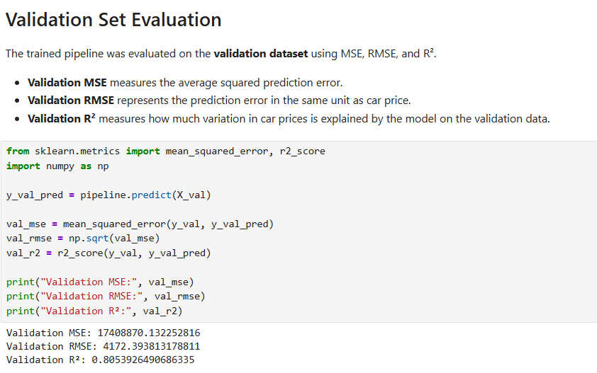


### Test Performance

| Metric | Test |
|---|---:|
| **R²**     | **0.8237**  |
| **RMSE**   | **3935.17** |

The final model achieved an **R² score of 0.8237 on the test set**, meaning that approximately **82.37% of the variation in car prices is explained by the model**.
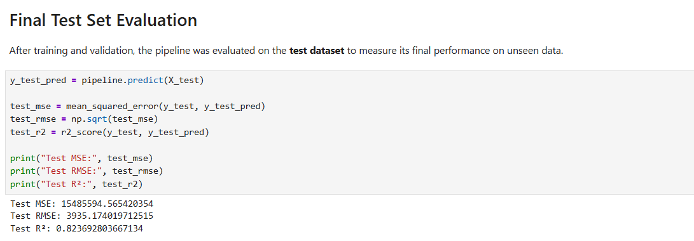

---

# Model Comparison

| Model | Features | R² | RMSE |
|---|---|---:|---:|
| **Model 1**         | Numerical features                | 0.7238     | 4924.96     |
| **Model 2**         | Numerical + categorical + `model` | **0.8237** | **3935.17** |

### Observation

Model 2 provides better performance than Model 1.

The progression is:

```text
Model 1 → R² = 0.7238
Model 2 → R² = 0.8237
```

At the same time, RMSE decreased:

```text
Model 1 → 4924.96
Model 2 → 3935.17
```

This shows that adding categorical information, particularly the car `model`, improved the model's ability to predict car prices.

---

# Regression Metrics

The following evaluation metrics were used to evaluate the Linear Regression models.

## Mean Squared Error (MSE)

MSE measures the average squared difference between actual and predicted prices.

```python
MSE = mean_squared_error(y_test, y_pred)
```

---

## Root Mean Squared Error (RMSE)

RMSE is the square root of MSE and represents prediction error in the same unit as the target variable.

```python
RMSE = np.sqrt(MSE)
```

---

## R² Score

R² measures how much of the variation in car prices is explained by the model.

```python
R² = r2_score(y_test, y_pred)
```

An R² value closer to 1 indicates that the model explains a larger proportion of the variation in the target variable.

---

# SST, SSE and SSR

The project also calculates the components used to understand regression performance.

## SST — Total Sum of Squares

SST measures the **total variation** in the actual prices.

```python
SST = np.sum((y_test - y_mean) ** 2)
```

---

## SSE — Sum of Squared Errors

SSE measures the **unexplained variation** between actual and predicted values.

```python
SSE = np.sum((y_test - y_pred) ** 2)
```

---

## SSR — Regression Sum of Squares

SSR measures the **variation explained by the regression model**.

```python
SSR = np.sum((y_pred - y_mean) ** 2)
```

The relationship between these values is:

```python
SST = SSR + SSE
```

R² can also be calculated manually as:

```python
R² = SSR / SST
```

or:

```python
R² = 1 - SSE / SST
```

---

# Overfitting Check

Training and testing performance were compared for the final model.

| Metric | Training | Testing |
|---|---:|---:|
| **R²**                | 0.8262  | 0.8237  |
| **RMSE**              | 3847.80 | 3935.17 |

### Observation

The training and testing results are very close.

The small difference between training and testing performance suggests that there is **no obvious sign of overfitting** in the final model.

---

# Model Saving and Loading

The trained Pipeline was saved using Python's **Pickle** module.

### Save the Model

```python
import pickle

with open("car_price_model.pkl", "wb") as file:
    pickle.dump(pipeline, file)

```
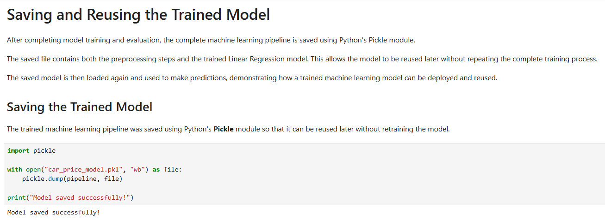


### Load the Model

```python
with open("car_price_model.pkl", "rb") as file:
    model = pickle.load(file)

```

The saved model can then be used to make predictions:

```python
model.predict(X_test)

```

This allows the trained preprocessing and Linear Regression model to be reused without retraining from scratch.

---

# Technologies Used

- **Python** 
- **Pandas** 
- **NumPy** 
- **Matplotlib** 
- **Seaborn** 
- **Scikit-learn** 
- **Jupyter Notebook** 
- **Pickle** 

---

# Project Structure

```text
Car-Price-Prediction/

│
├── linear.ipynb
├── cars_dataset.csv
├── car_price_model.pkl
├── README.md
└── requirements.txt

```

---

# Conclusion

This project demonstrates a complete **Linear Regression workflow** for predicting used car prices.

The initial model using only numerical features achieved an **R² of 0.7238** with an RMSE of **4924.96**.

The final Model 2 incorporated both numerical and categorical features, including the car `model`. It achieved a **test R² of 0.8237** and a **test RMSE of 3935.17**.

The training and testing results were also close:

```text
Training R² = 0.8262
Testing R²  = 0.8237

```

Overall, the project demonstrates how **data cleaning, EDA, feature selection, categorical encoding, pipeline-based preprocessing, model evaluation, and model serialization** can be combined to build a Linear Regression model for used-car price prediction.
